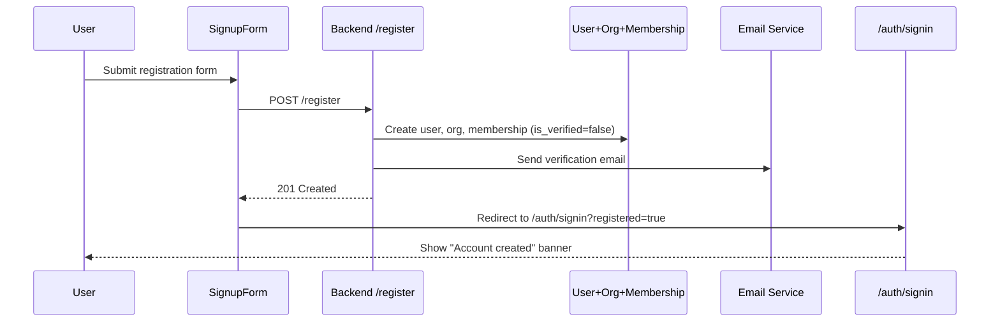
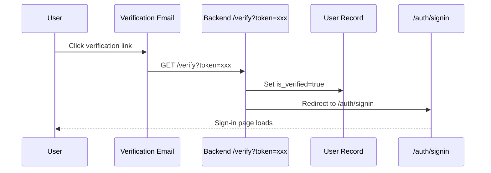
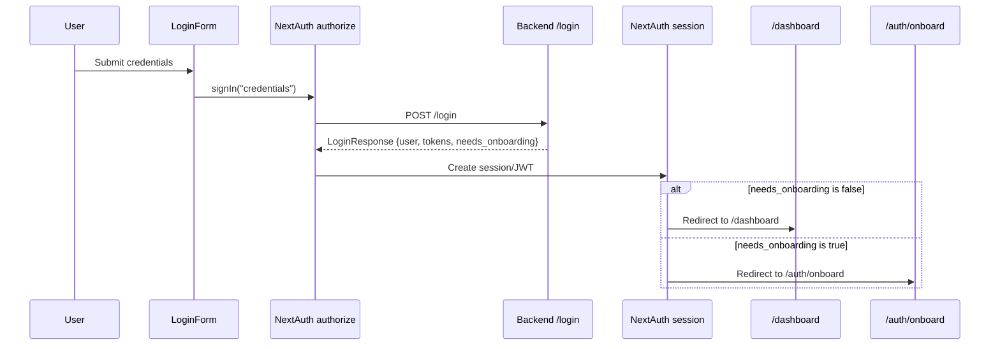
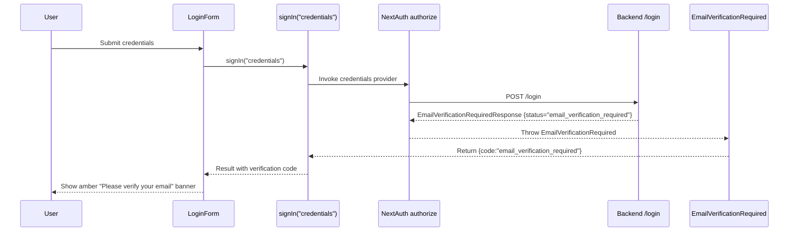
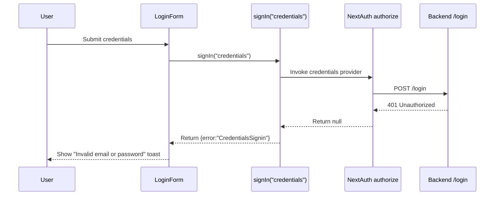
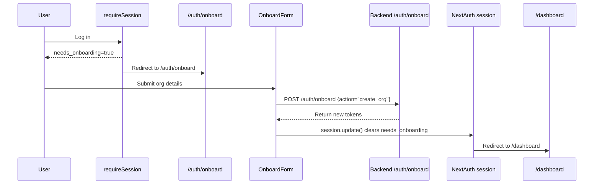

# Authentication System

Documentation for the dev-health-web authentication and authorization architecture.

## Overview

The system uses **NextAuth.js v5 (beta)** with the `CredentialsProvider`. 

- **Central Config**: `src/lib/auth.ts`
- **Exports**: `auth`, `handlers`, `signIn`, `signOut`
- **Provider**: Custom `CredentialsProvider` authenticating against the backend API.

## Authentication Flow

1. User submits credentials via `/auth/signin`.
2. `CredentialsProvider` calls backend `/api/v1/auth/login`.
3. Backend returns JWT and user metadata.
4. NextAuth stores the backend token and user info in its own session/JWT.

**Session Data**:
- `access_token`: Backend API bearer token
- `role`: User's primary role (e.g., "admin", "viewer")
- `is_superuser`: Boolean flag for global access
- `permissions`: Array of specific permission strings

## User Journeys

### Journey 1: New User Registration



### Journey 2: Email Verification



### Journey 3: Login (Happy Path - verified user)



### Journey 4: Login (Unverified Email)



### Journey 5: Login (Invalid Credentials)



### Journey 6: Onboarding (for invited users without org)



### Journey 7: Password Reset

```mermaid
flowchart TD
    U[User] --> FP[/forgot-password]
    FP --> B1[Backend sends reset email]
    B1 --> E[User clicks reset link]
    E --> RP[/reset-password?token=xxx]
    RP --> B2[New password set]
    B2 --> SI[/auth/signin]
```

### Journey 8: SSO / Invite Accept

```mermaid
flowchart TD
    A[Admin creates invite] --> E[User receives email]
    E --> AI[/accept-invite?token=xxx]
    AI --> M[Creates membership]
    M --> L[Login]
```

## Email Verification Banner

The email verification banner is shown when a user attempts to sign in with valid credentials but an unverified email.

- **When it appears**: During login, when the backend indicates the account must be verified first.
- **What the user sees**: An amber banner with the message "Please verify your email".
- **Technical implementation**: `EmailVerificationRequired` extends `CredentialsSignin` with `code = "email_verification_required"`. It is thrown in the `authorize` callback when the backend responds with `{ status: "email_verification_required" }`.
- **Login form behavior**: `LoginForm` checks `result.code === "email_verification_required"` and renders the verification banner.

## Session Shape

The `session.user` object is extended beyond standard NextAuth fields:

```typescript
{
  user: {
    id: string;
    email: string;
    name: string;
    role: string;
    is_superuser: boolean;
    permissions: string[];
    impersonator?: {
      id: string;
      name: string;
    };
  };
  expires: string;
}
```

JWT and session callbacks handle the mapping from backend response to this structure, including support for impersonation.

## Auth Guards

Server-side guards located in `src/lib/auth.ts`:

- `requireSession()`: Redirects to `/auth/signin` if no valid session exists.
- `requireRole(roles: string[])`: Verifies user has one of the required roles OR `is_superuser === true`. Redirects to `/dashboard` on failure.
- `requireSuperuser()`: Strict check for `is_superuser === true`. Redirects to `/dashboard` on failure.

## Proxy Integration

`src/proxy.ts` enforces authentication at the network level for API requests.

- **Enforcement**: Unauthenticated requests to non-`PUBLIC_PATHS` are redirected to `/auth/signin`.
- **Injection**: Automatically injects the `Authorization: Bearer <access_token>` header into outgoing API/GraphQL requests.
- **Next.js 16 Constraint**: `proxy.ts` and `middleware.ts` **cannot coexist**. The proxy handles both routing logic and header injection.

## Route Group Security

Security is enforced via layouts in specific route groups:

| Route Group | Layout File | Guard Applied |
|-------------|-------------|---------------|
| `(app)` | `src/app/(app)/layout.tsx` | `requireSession()` |
| `(app)/admin` | `src/app/(app)/admin/layout.tsx` | `requireRole(["admin", "owner"])` |
| `(app)/superadmin` | `src/app/(app)/superadmin/layout.tsx` | `requireSuperuser()` |
| `(auth)` | `src/app/(auth)/layout.tsx` | Public (No guard) |
| `(marketing)` | `src/app/(marketing)/layout.tsx` | Public (No guard) |

## Impersonation

Support for "Login as User" functionality:

- **Logic**: Handled via JWT/session callbacks that swap the active user context while preserving the original admin's identity in `impersonator`.
- **UI**: The `ImpersonationBanner` component renders at the top of the app when `session.user.impersonator` is present.

## Key Files

| File | Purpose |
|------|---------|
| `src/lib/auth.ts` | NextAuth configuration and callbacks |
| `src/proxy.ts` | Network-level auth enforcement and header injection |
| `src/lib/auth.ts` (guards) | Server-side redirect logic (`requireSession`, `requireRole`, `requireSuperuser`) |
| `src/components/auth/ImpersonationBanner.tsx` | UI indicator for active impersonation |

## Environment Variables

Auth-related environment variables (see `.env.example` for full list):

| Variable | Required | Description |
|----------|----------|-------------|
| `AUTH_SECRET` | Production | Secret used to sign/encrypt JWTs. Generate with `openssl rand -base64 32`. Auto-generated in dev. |
| `AUTH_URL` | Non-localhost | Full URL where the app is hosted (e.g., `https://app.example.com`). Required for CSRF origin validation in Docker, reverse proxy, or production environments. Without this, sign-in/sign-up fails with a "request origin validation" error. Auto-detected on `localhost`. |
| `BACKEND_URL` | Always | URL of the dev-health-ops backend API (default: `http://127.0.0.1:8000`). |

### Troubleshooting: "request origin validation" error

If you see this error during sign-in or sign-up, Auth.js cannot match the request's `Origin` header against the expected URL. This happens when:

1. Running behind a reverse proxy (nginx, Caddy, etc.)
2. Running in Docker with port mapping
3. Deployed to production without `AUTH_URL` set

**Fix:** Set `AUTH_URL` to the publicly accessible URL of the app:

```bash
AUTH_URL=https://app.example.com  # production
AUTH_URL=http://localhost:3000     # local dev (usually auto-detected)
```
