# Authentication System

Documentation for the dev-health-web authentication and authorization architecture.

## Overview

The system uses **NextAuth.js v5 (beta)** with the `CredentialsProvider`.

- **Central Config**: `src/lib/auth.ts`
- **Exports**: `auth`, `handlers`, `signIn`, `signOut`
- **Provider**: Custom `CredentialsProvider` authenticating against the backend API.

## Authentication Flow

1. User submits credentials via `/auth/signin`.
2. `CredentialsProvider` calls backend `/api/v1/auth/login`.
3. Backend returns JWT and user metadata.
4. NextAuth stores the backend token and user info in its own session/JWT.

**Session Data**:

- `access_token`: Backend API bearer token
- `role`: User's primary role (e.g., "admin", "viewer")
- `is_superuser`: Boolean flag for global access
- `permissions`: Array of specific permission strings

## User Journeys

All supported **authentication** journeys documented below. Each includes a Mermaid diagram and test coverage annotations showing where the journey is verified.

> For non-auth journeys (onboarding, admin, user, platform admin), see [User Journeys](user-journeys/README.md).

### Authentication

#### Registration

New user creates an account. Backend auto-creates user, organization, and owner membership in a single transaction.

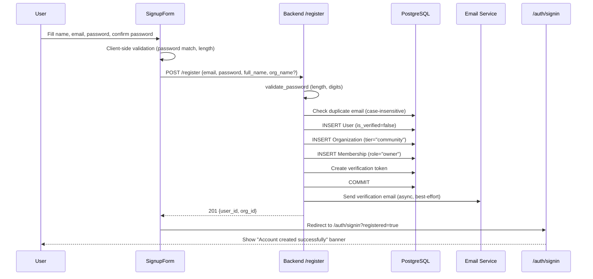

**Rate limit:** 3 registrations per hour per IP.

| Test Layer          | File                                         | What is verified                                                           |
| ------------------- | -------------------------------------------- | -------------------------------------------------------------------------- |
| Backend unit        | `tests/api/auth/test_register.py`            | 201 response, DB records, duplicate rejection, password policy, email send |
| Backend unit        | `tests/api/auth/test_email_normalization.py` | Case-insensitive duplicate detection                                       |
| Backend integration | `tests/api/test_new_user_journey.py`         | Register creates user+org+membership                                       |

> **Note:** Backend test references (Python/pytest paths like `tests/api/...`) are in the [`dev-health-ops`](https://github.com/chrisgeo/dev-health-ops) repository, not this repo.
> | Frontend unit | `src/components/auth/SignupForm.test.tsx` | Form rendering, validation, redirect, error handling |
> | Frontend E2E | `tests/auth-signup.spec.ts` | Full form submission, mismatch/short password, duplicate email |
> | Frontend E2E | `tests/account-creation-journey.spec.ts` (step 1) | Signup redirects with banner |
> | Live E2E | `tests/live/onboarding-ui.spec.ts` | Full signup flow against real backend |

#### Email Verification

User clicks the verification link from their inbox. Backend validates the token and marks the user as verified.

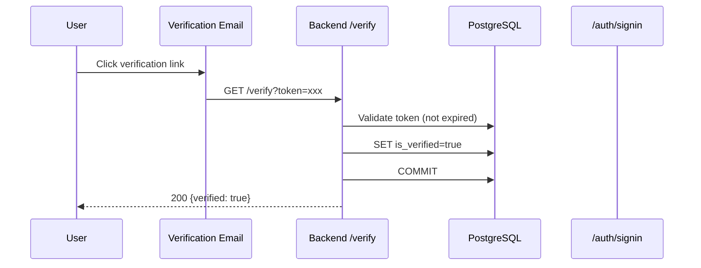

Resend flow: `POST /resend-verification` creates a new token and resends. Returns a generic message regardless of account existence (anti-enumeration).

| Test Layer   | File                                                    | What is verified                                                  |
| ------------ | ------------------------------------------------------- | ----------------------------------------------------------------- |
| Backend unit | `tests/api/auth/test_email_verification_enforcement.py` | Token validation, user marked verified, resend always returns 200 |

#### Login (Happy Path)

Verified user submits credentials. Backend validates password, resolves org membership, returns tokens.

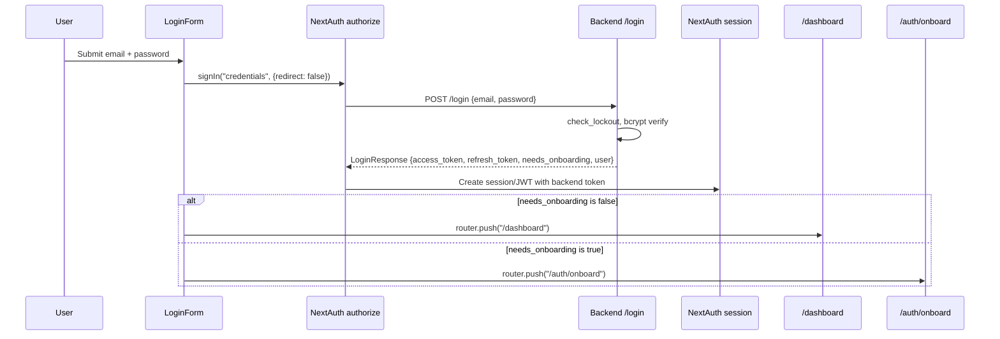

| Test Layer          | File                                                    | What is verified                           |
| ------------------- | ------------------------------------------------------- | ------------------------------------------ |
| Backend unit        | `tests/api/auth/test_email_normalization.py`            | Case-insensitive lookup                    |
| Backend unit        | `tests/api/auth/test_email_verification_enforcement.py` | Verified user can login                    |
| Backend integration | `tests/api/test_new_user_journey.py`                    | Register then login returns tokens         |
| Frontend unit       | `src/components/auth/LoginForm.test.tsx`                | Dashboard redirect on success              |
| Frontend E2E        | `tests/auth-signin.spec.ts`                             | Form renders, error toast                  |
| Frontend E2E        | `tests/account-creation-journey.spec.ts` (step 2-3)     | Login then onboard then dashboard          |
| Live E2E            | `tests/live/onboarding-ui.spec.ts`                      | Login with verified user reaches dashboard |

#### Login (Unverified Email)

User has valid credentials but has not verified their email.

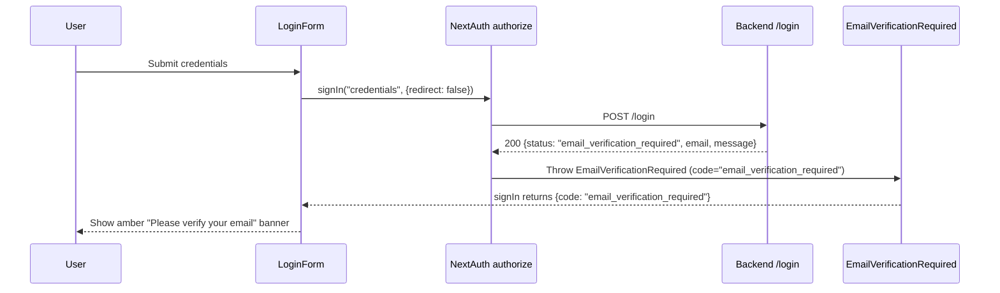

The backend returns HTTP 200 (not 401) with `status: "email_verification_required"`. The frontend `EmailVerificationRequired` class extends `CredentialsSignin` with `code = "email_verification_required"`. `LoginForm` checks `result.code` and renders the amber banner instead of an error toast.

| Test Layer    | File                                                    | What is verified                                          |
| ------------- | ------------------------------------------------------- | --------------------------------------------------------- |
| Backend unit  | `tests/api/auth/test_email_verification_enforcement.py` | Unverified local user gets verification required response |
| Backend unit  | `tests/api/auth/test_email_verification_enforcement.py` | OAuth user bypasses verification                          |
| Frontend unit | `src/components/auth/LoginForm.test.tsx`                | Banner shown for verification code                        |

#### Login (Invalid Credentials / Account Lockout)

Password mismatch, nonexistent user, or disabled account. Constant-time comparison using `DUMMY_PASSWORD_HASH` prevents timing attacks.

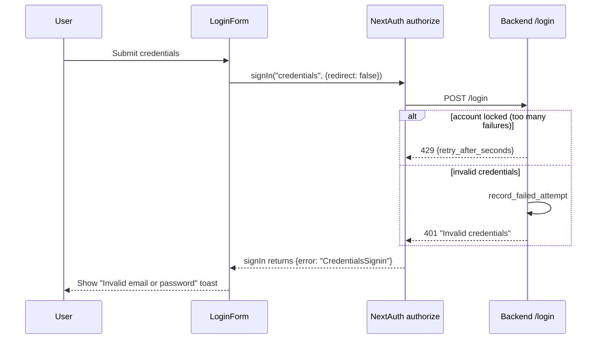

| Test Layer    | File                                         | What is verified                 |
| ------------- | -------------------------------------------- | -------------------------------- |
| Backend unit  | `tests/api/auth/test_email_normalization.py` | Nonexistent user returns 401     |
| Frontend unit | `src/components/auth/LoginForm.test.tsx`     | Error toast on CredentialsSignin |
| Frontend E2E  | `tests/auth-signin.spec.ts`                  | Error toast on failed login      |

#### Password Reset

Two-step flow: request reset email, then submit new password with token.

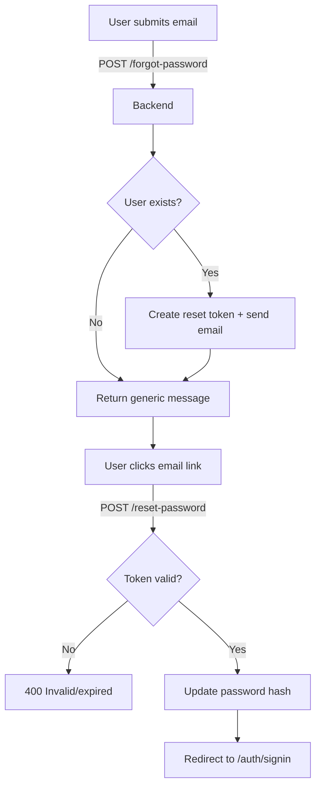

Anti-enumeration: `POST /forgot-password` always returns the same message regardless of whether the account exists.

| Test Layer   | File                                    | What is verified                                                                             |
| ------------ | --------------------------------------- | -------------------------------------------------------------------------------------------- |
| Backend unit | `tests/api/auth/test_password_reset.py` | Token creation, password update, expired token rejection, generic response for unknown email |

**Gap:** No frontend E2E tests for forgot-password or reset-password pages.

### Onboarding

#### Workspace Creation (create_org)

For users without an organization membership. Typically occurs after invite-based registration where the user was not auto-assigned to an org.

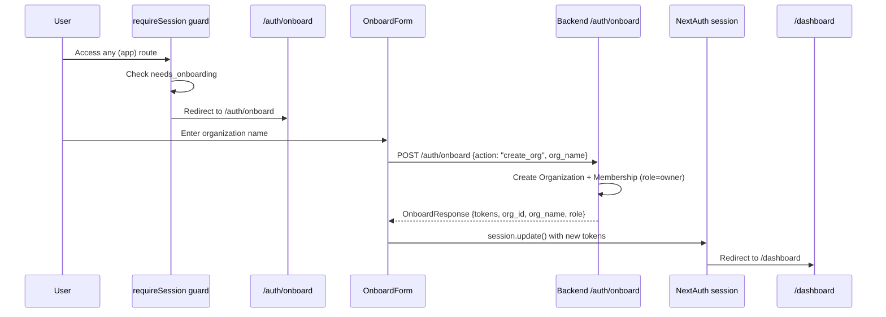

| Test Layer    | File                                              | What is verified                                                   |
| ------------- | ------------------------------------------------- | ------------------------------------------------------------------ |
| Backend unit  | `tests/test_onboarding.py`                        | Org creation, token return, already-onboarded rejection            |
| Frontend unit | `src/components/auth/OnboardForm.test.tsx`        | Form submission, redirect, error handling                          |
| Frontend E2E  | `tests/auth-onboard.spec.ts`                      | Form renders, creates workspace, blank name fallback               |
| Frontend E2E  | `tests/account-creation-journey.spec.ts` (step 3) | Login -> onboard -> dashboard                                      |
| Live E2E      | `tests/live/journey.spec.ts`                      | POST /onboard with org_name, re-login shows needs_onboarding=false |

#### Join Organization (join_org)

User joins an existing organization via invite code during onboarding.

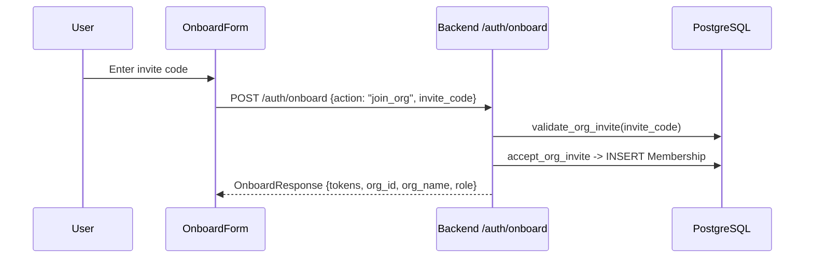

| Test Layer   | File                                 | What is verified                       |
| ------------ | ------------------------------------ | -------------------------------------- |
| Backend unit | `tests/test_onboarding.py`           | Authentication required for onboard    |
| Backend unit | `tests/api/auth/test_invite_flow.py` | Invite validation, membership creation |

### Organization Invitations

#### Invite Lifecycle (Create -> Accept)

Admin creates an invite; invited user accepts it to join the organization.

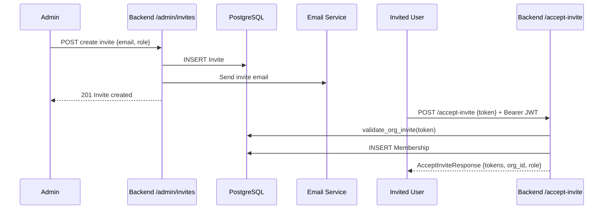

| Test Layer   | File                                 | What is verified                                                                                                                     |
| ------------ | ------------------------------------ | ------------------------------------------------------------------------------------------------------------------------------------ |
| Backend unit | `tests/api/auth/test_invite_flow.py` | Admin can create (member cannot), accept creates membership, expired token rejected, duplicate invite rejected, already-member error |

**Gap:** No frontend E2E tests for invite creation or acceptance UI.

### Impersonation

Superuser "Login as User" functionality for debugging and support.

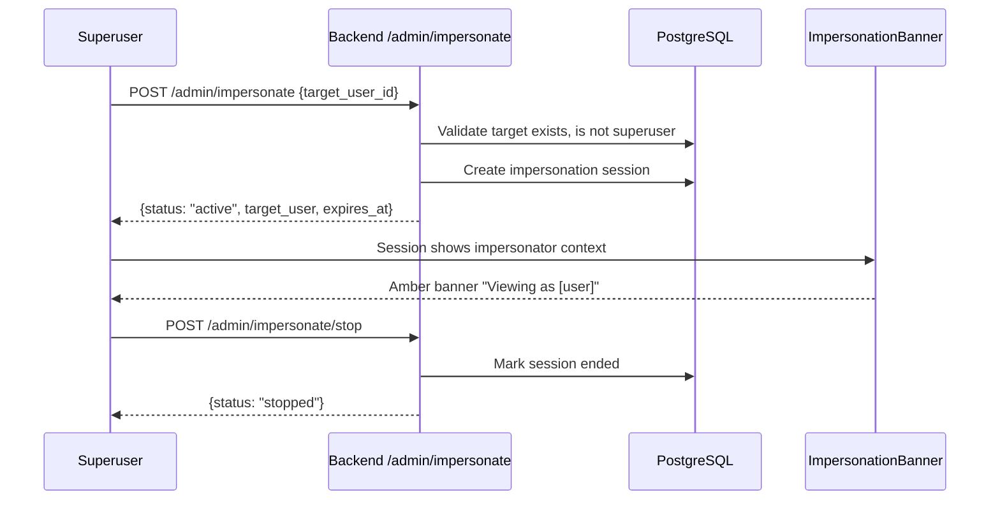

| Test Layer    | File                                              | What is verified                                                                                                                                      |
| ------------- | ------------------------------------------------- | ----------------------------------------------------------------------------------------------------------------------------------------------------- |
| Backend unit  | `tests/api/admin/test_impersonation_endpoints.py` | Start/stop/status lifecycle, target-not-found, superuser-to-superuser blocked, self-impersonation blocked, non-superuser rejected, cache invalidation |
| Frontend unit | `src/lib/__tests__/access-matrix.test.ts`         | RBAC guards under impersonated sessions, tier gating for impersonated org                                                                             |
| Live E2E      | `tests/live/impersonation.spec.ts`                | Full lifecycle: start -> status -> stop, superuser-to-superuser 403, unauthenticated rejection                                                        |

### SSO (SAML / OIDC)

Enterprise SSO authentication via SAML 2.0 or OpenID Connect.

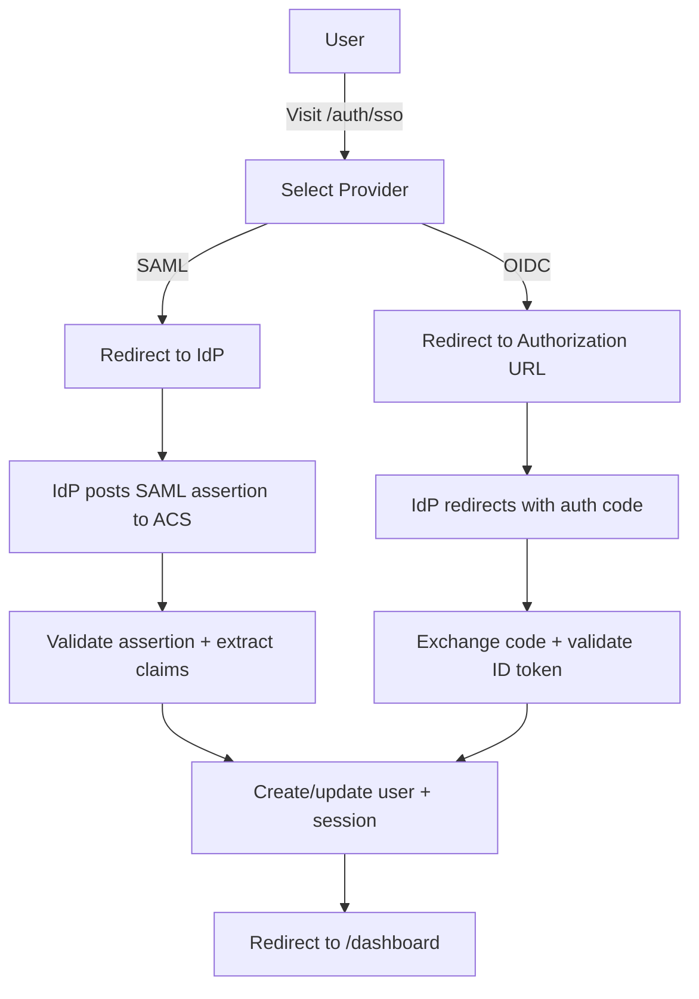

| Test Layer   | File                                                    | What is verified                                                                                     |
| ------------ | ------------------------------------------------------- | ---------------------------------------------------------------------------------------------------- |
| Backend unit | `tests/api/services/test_sso.py`                        | SAML assertion validation, OIDC code exchange, state mismatch detection, expired assertion rejection |
| Backend unit | `tests/api/auth/test_sso_module.py`                     | SSO router registration, endpoint presence, tag assignment                                           |
| Backend unit | `tests/api/auth/test_email_verification_enforcement.py` | OAuth users bypass email verification                                                                |

### RBAC & Access Control

Role-based access control enforced at both route layout and API levels.

```mermaid
flowchart TD
    R[Request] --> RS{requireSession}
    RS -->|No session| SI[/auth/signin]
    RS -->|needs_onboarding| OB[/auth/onboard]
    RS -->|Valid session| RR{Route group?}
    RR -->|"(app)"| APP[App pages]
    RR -->|"(app)/admin"| RG{requireRole admin/owner}
    RR -->|"(app)/superadmin"| SU{requireSuperuser}
    RG -->|Denied| DASH[/dashboard]
    RG -->|Allowed| ADMIN[Admin pages]
    SU -->|Denied| DASH
    SU -->|is_superuser=true| SADMIN[Superadmin pages]
```

| Test Layer    | File                                      | What is verified                                                                                                              |
| ------------- | ----------------------------------------- | ----------------------------------------------------------------------------------------------------------------------------- |
| Frontend unit | `src/lib/__tests__/auth.test.ts`          | Session redirect, onboard redirect, valid session passthrough                                                                 |
| Frontend unit | `src/lib/__tests__/access-matrix.test.ts` | Full RBAC matrix: 6 personas x 3 gates, tier feature gating (community/team/enterprise), superuser bypass, impersonation RBAC |
| Frontend E2E  | `tests/admin.spec.ts`                     | Admin redirect for unauthenticated users                                                                                      |
| Live E2E      | `tests/live/pages.spec.ts`                | Dashboard and work page redirect to signin                                                                                    |

### Admin Portal Setup

After authentication, admin users configure integrations, sync, teams, and identities.

#### Full Account Setup Journey

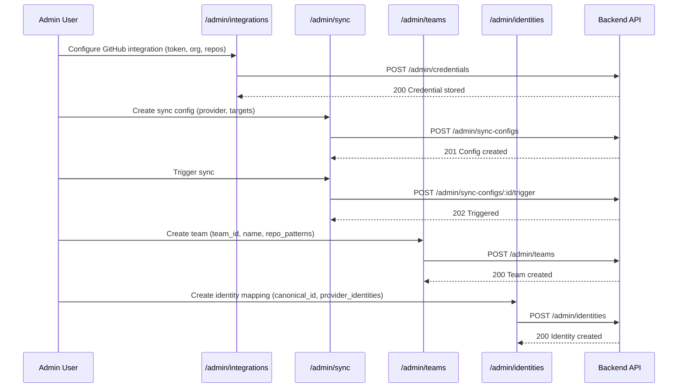

| Test Layer          | File                                                 | What is verified                                                                    |
| ------------------- | ---------------------------------------------------- | ----------------------------------------------------------------------------------- |
| Backend integration | `tests/api/test_new_user_journey.py`                 | Register -> login -> create credential -> create sync config -> trigger sync        |
| Backend integration | `tests/api/test_new_user_journey.py`                 | Register -> create identity -> create team                                          |
| Backend unit        | `tests/api/admin/test_sync_configs.py`               | CRUD, trigger, job listing                                                          |
| Backend unit        | `tests/api/admin/test_teams.py`                      | CRUD, import, Celery sync trigger                                                   |
| Backend unit        | `tests/api/admin/test_identities.py`                 | CRUD, active/inactive filtering                                                     |
| Backend unit        | `tests/test_admin_credentials.py`                    | CRUD, test connection, inline persist                                               |
| Frontend E2E        | `tests/account-creation-journey.spec.ts` (steps 4-7) | GitHub integration -> sync config -> team -> identity                               |
| Frontend E2E        | `tests/admin-integrations.spec.ts`                   | GitHub/GitLab/Jira/Linear forms, save, test connection                              |
| Frontend E2E        | `tests/admin-sync.spec.ts`                           | Form rendering, provider filtering, target checkboxes                               |
| Frontend E2E        | `tests/admin-teams.spec.ts`                          | Create team, validation, cancel                                                     |
| Frontend E2E        | `tests/admin-identities.spec.ts`                     | Create identity, provider identity rows                                             |
| Frontend unit       | `src/lib/admin/__tests__/server.test.ts`             | Server actions for credentials, users, audit logs, IP allowlist, retention          |
| Live E2E            | `tests/live/journey.spec.ts`                         | Full API journey: register -> login -> credential -> sync config -> trigger -> jobs |

### Unauthenticated Access

Public pages are accessible without authentication. Protected pages redirect to signin.

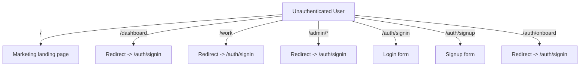

| Test Layer   | File                         | What is verified                                             |
| ------------ | ---------------------------- | ------------------------------------------------------------ |
| Frontend E2E | `tests/auth-onboard.spec.ts` | Unauthenticated onboard access redirects to signin           |
| Live E2E     | `tests/live/pages.spec.ts`   | Marketing page accessible, dashboard/work redirect to signin |

### Enterprise Features

Enterprise-tier features with tier-based gating.

| Feature             | Backend Tests                                                                      | Frontend Tests                                                             |
| ------------------- | ---------------------------------------------------------------------------------- | -------------------------------------------------------------------------- |
| IP Allowlisting     | `tests/api/admin/test_ip_allowlist.py` - CRUD, CIDR validation, IP check           | `src/lib/admin/__tests__/server.test.ts` - server actions                  |
| Retention Policies  | `tests/api/admin/test_retention.py` - CRUD, execution, resource types              | `src/lib/admin/__tests__/server.test.ts` - server actions                  |
| Audit Logging       | `tests/api/admin/test_impersonation_endpoints.py` - audit entries on impersonation | `src/lib/admin/__tests__/server.test.ts` - list/get/filter                 |
| Tier Feature Gating | `tests/test_community_features.py` - community denies enterprise features          | `src/lib/__tests__/access-matrix.test.ts` - sidebar filtering, UpgradeGate |

### Token Lifecycle

#### Token Refresh

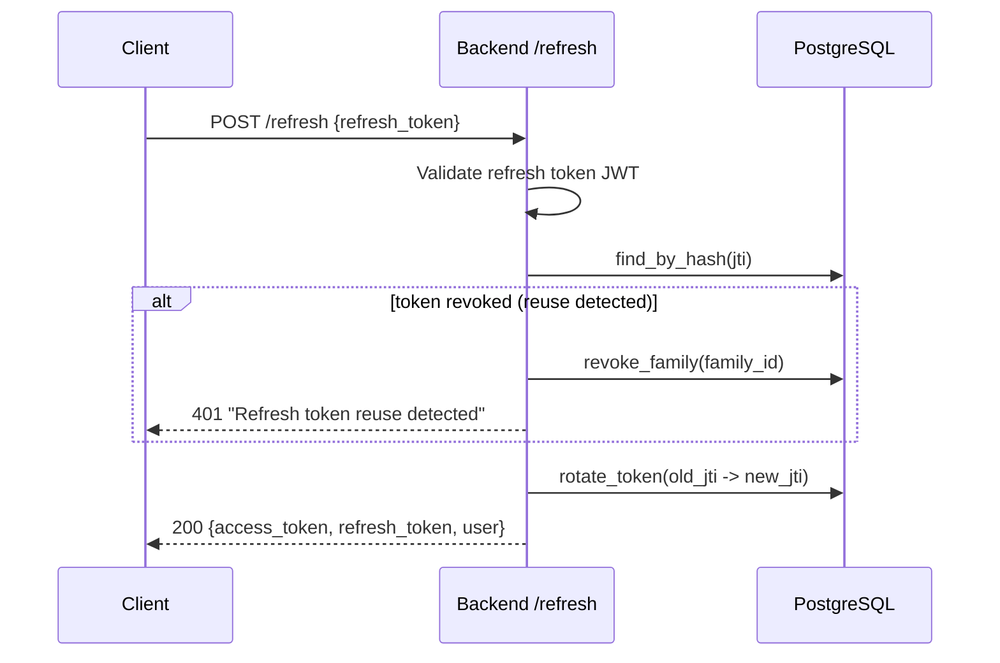

Refresh tokens are single-use with family-based reuse detection.

#### Logout

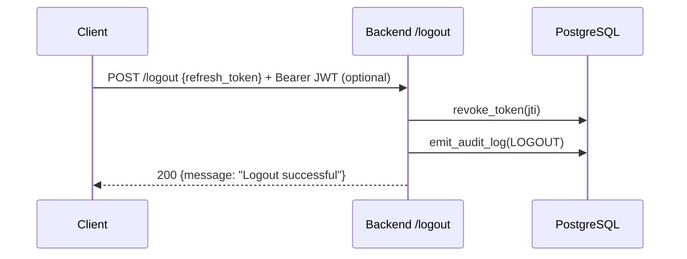

## Test Coverage Summary

### Fully Covered Journeys

| Journey                    | Backend | Frontend Unit | Frontend E2E | Live E2E |
| -------------------------- | ------- | ------------- | ------------ | -------- |
| Registration               | ✅      | ✅            | ✅           | ✅       |
| Email Verification         | ✅      | —             | —            | —        |
| Login (happy path)         | ✅      | ✅            | ✅           | ✅       |
| Login (unverified)         | ✅      | ✅            | —            | —        |
| Login (invalid)            | ✅      | ✅            | ✅           | —        |
| Onboarding (create_org)    | ✅      | ✅            | ✅           | ✅       |
| Admin Setup (full journey) | ✅      | ✅            | ✅           | ✅       |
| RBAC / Access Matrix       | —       | ✅            | ✅           | ✅       |
| Impersonation              | ✅      | ✅            | —            | ✅       |
| SSO (SAML/OIDC)            | ✅      | —             | —            | —        |

### Coverage Gaps

| Journey                   | Missing Coverage                                                    | Priority |
| ------------------------- | ------------------------------------------------------------------- | -------- |
| Password Reset            | No frontend E2E tests for /forgot-password or /reset-password pages | Medium   |
| Email Verification        | No frontend E2E test for clicking verification link                 | Low      |
| Invite Accept             | No frontend E2E tests for invite creation or acceptance UI          | Medium   |
| Session Expiry            | No tests for re-authentication after expired session                | Low      |
| Onboarding (join_org)     | No frontend E2E test for join via invite code                       | Medium   |
| Billing -> Feature Unlock | No integration test for upgrade -> pay -> feature unlocked          | Low      |

## Session Shape

The `session.user` object is extended beyond standard NextAuth fields:

```typescript
{
  user: {
    id: string;
    email: string;
    name: string;
    role: string;
    is_superuser: boolean;
    permissions: string[];
    impersonator?: {
      id: string;
      name: string;
    };
  };
  expires: string;
}
```

JWT and session callbacks handle the mapping from backend response to this structure, including support for impersonation.

## Auth Guards

Server-side guards located in `src/lib/auth.ts`:

- `requireSession()`: Redirects to `/auth/signin` if no valid session exists.
- `requireRole(roles: string[])`: Verifies user has one of the required roles OR `is_superuser === true`. Redirects to `/dashboard` on failure.
- `requireSuperuser()`: Strict check for `is_superuser === true`. Redirects to `/dashboard` on failure.

## Proxy Integration

`src/proxy.ts` enforces authentication at the network level for API requests.

- **Enforcement**: Unauthenticated requests to non-`PUBLIC_PATHS` are redirected to `/auth/signin`.
- **Injection**: Automatically injects the `Authorization: Bearer <access_token>` header into outgoing API/GraphQL requests.
- **Next.js 16 Constraint**: `proxy.ts` and `middleware.ts` **cannot coexist**. The proxy handles both routing logic and header injection.

## Route Group Security

Security is enforced via layouts in specific route groups:

| Route Group        | Layout File                           | Guard Applied                     |
| ------------------ | ------------------------------------- | --------------------------------- |
| `(app)`            | `src/app/(app)/layout.tsx`            | `requireSession()`                |
| `(app)/admin`      | `src/app/(app)/admin/layout.tsx`      | `requireRole(["admin", "owner"])` |
| `(app)/superadmin` | `src/app/(app)/superadmin/layout.tsx` | `requireSuperuser()`              |
| `(auth)`           | `src/app/(auth)/layout.tsx`           | Public (No guard)                 |
| `(marketing)`      | `src/app/(marketing)/layout.tsx`      | Public (No guard)                 |

## Impersonation

Support for "Login as User" functionality:

- **Logic**: Handled via JWT/session callbacks that swap the active user context while preserving the original admin's identity in `impersonator`.
- **UI**: The `ImpersonationBanner` component renders at the top of the app when `session.user.impersonator` is present.

## Key Files

| File                                          | Purpose                                                                          |
| --------------------------------------------- | -------------------------------------------------------------------------------- |
| `src/lib/auth.ts`                             | NextAuth configuration and callbacks                                             |
| `src/proxy.ts`                                | Network-level auth enforcement and header injection                              |
| `src/lib/auth.ts` (guards)                    | Server-side redirect logic (`requireSession`, `requireRole`, `requireSuperuser`) |
| `src/components/auth/ImpersonationBanner.tsx` | UI indicator for active impersonation                                            |

## Environment Variables

Auth-related environment variables (see `.env.example` for full list):

| Variable      | Required      | Description                                                                                                                                                                                                                                                               |
| ------------- | ------------- | ------------------------------------------------------------------------------------------------------------------------------------------------------------------------------------------------------------------------------------------------------------------------- |
| `AUTH_SECRET` | Production    | Secret used to sign/encrypt JWTs. Generate with `openssl rand -base64 32`. Auto-generated in dev.                                                                                                                                                                         |
| `AUTH_URL`    | Non-localhost | Full URL where the app is hosted (e.g., `https://app.example.com`). Required for CSRF origin validation in Docker, reverse proxy, or production environments. Without this, sign-in/sign-up fails with a "request origin validation" error. Auto-detected on `localhost`. |
| `BACKEND_URL` | Always        | URL of the dev-health-ops backend API (default: `http://127.0.0.1:8000`).                                                                                                                                                                                                 |

### Troubleshooting: "request origin validation" error

If you see this error during sign-in or sign-up, Auth.js cannot match the request's `Origin` header against the expected URL. This happens when:

1. Running behind a reverse proxy (nginx, Caddy, etc.)
2. Running in Docker with port mapping
3. Deployed to production without `AUTH_URL` set

**Fix:** Set `AUTH_URL` to the publicly accessible URL of the app:

```bash
AUTH_URL=https://app.example.com  # production
AUTH_URL=http://localhost:3000     # local dev (usually auto-detected)
```
