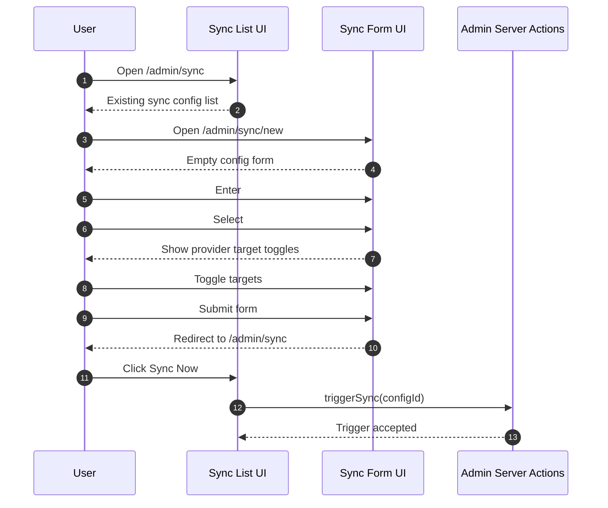
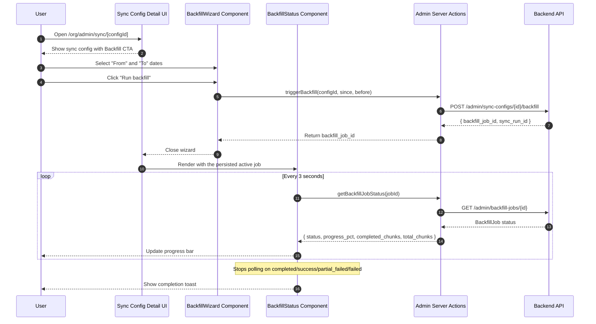
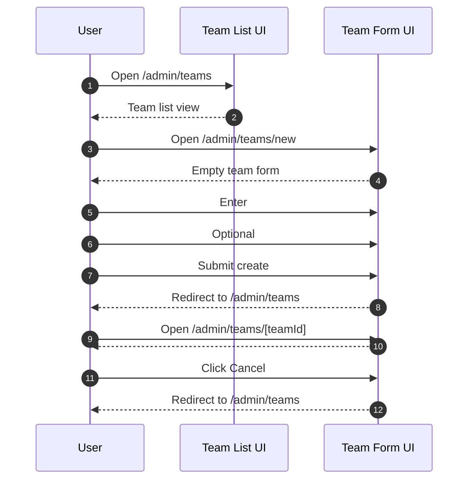
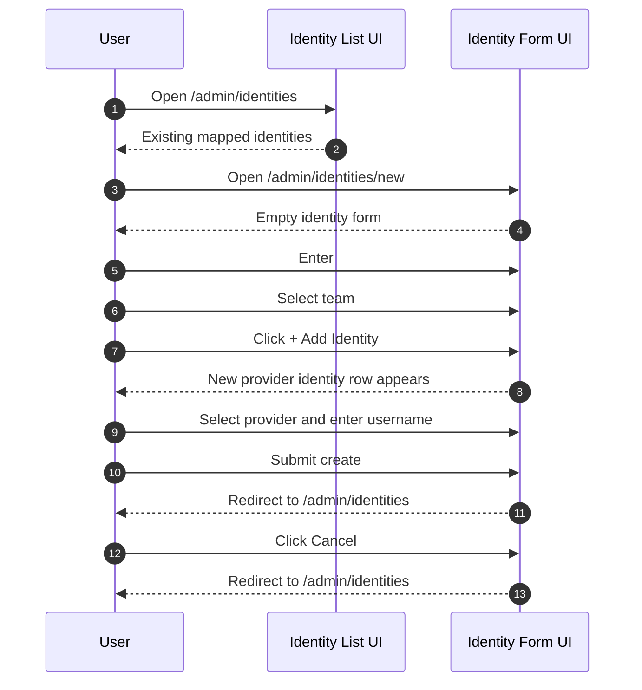
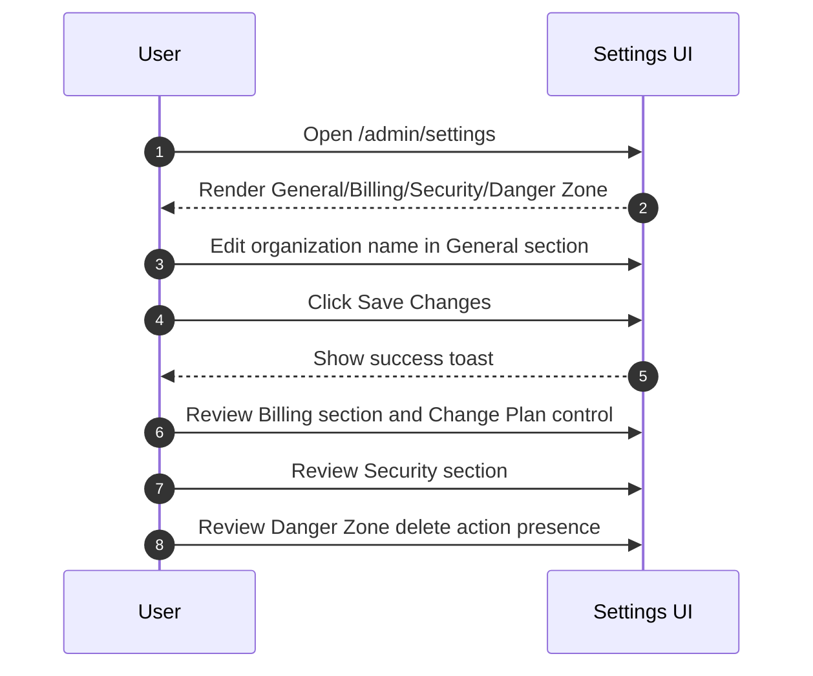

# E2E Spec: Account Admin Journeys

## Integration Setup

Purpose

- Covers provider credential setup and connection testing from admin integration pages.
- Confirms route handling for known and unknown providers.

Primary test files

- `tests/admin-integrations.spec.ts`
- `src/components/admin/integrations/IntegrationForm.test.tsx`

Core routes

- `/admin/integrations`
- `/admin/integrations/[provider]`

Supported provider route examples

- `/admin/integrations/github`
- `/admin/integrations/gitlab`
- `/admin/integrations/jira`
- `/admin/integrations/linear`

Form fields by provider

- GitHub: `#github-token`, `#github-org`, `#github-repos`
- GitLab: `#gitlab-token`, `#gitlab-group`
- Jira: `#jira-url`, `#jira-email`, `#jira-token`, `#jira-projects`
- Linear: `#linear-key`, `#linear-teams`

Server actions

- `createCredential` in `src/lib/admin/server.ts`
- `testConnection` in `src/lib/admin/server.ts`

Decision and routing flow

```mermaid
flowchart TD
    U[User opens /admin/integrations] --> C[Select provider card]
    C --> P{Provider known}
    P -- Yes --> F[Load /admin/integrations/[provider] form]
    P -- No --> N[Return 404]
    F --> I[Enter provider-specific fields]
    I --> S[Click Save Changes]
    S --> SC[createCredential server action]
    SC --> T1[Show success toast]
    I --> T[Click Test Connection]
    T --> TC[testConnection server action]
    TC --> T2[Show Connection successful]
```

Test coverage

| Layer         | Coverage | Tests                                                                                 | Notes                                                           |
| ------------- | -------- | ------------------------------------------------------------------------------------- | --------------------------------------------------------------- |
| Backend Unit  | ✅       | `test_admin_credentials.py`                                                           | Backend credential handling and related logic are unit-covered. |
| Frontend Unit | ✅       | `src/components/admin/integrations/IntegrationForm.test.tsx`                          | Validates form rendering and interaction behavior by provider.  |
| Frontend E2E  | ✅       | `tests/admin-integrations.spec.ts`, `tests/account-creation-journey.spec.ts` (step 4) | Confirms UI flow and inclusion in full setup journey.           |
| Live E2E      | ✅       | `tests/live/journey.spec.ts`                                                          | Validates integration step in live journey context.             |

## Sync Configuration

Purpose

- Covers create/edit/list lifecycle for sync configuration records.
- Verifies provider-aware sync target toggles and manual trigger action.

Primary test files

- `tests/admin-sync.spec.ts`
- `src/components/admin/sync/SyncConfigForm.test.tsx`

Routes

- `/admin/sync`
- `/admin/sync/new`
- `/admin/sync/[configId]`

Required fields

- `#name`
- `#provider` (select)
- `#credential_id` (select)

Provider target toggles

- GitHub: Git Data, PRs, CI/CD, Deployments
- Jira: Work Items

Trigger action

- `triggerSync(configId)` server action



Test coverage

| Layer         | Coverage | Tests                                                                         | Notes                                                   |
| ------------- | -------- | ----------------------------------------------------------------------------- | ------------------------------------------------------- |
| Backend Unit  | ✅       | `test_sync_configs.py`                                                        | Covers backend sync config lifecycle semantics.         |
| Frontend Unit | ✅       | `src/components/admin/sync/SyncConfigForm.test.tsx`                           | Covers provider-target toggles and form-level behavior. |
| Frontend E2E  | ✅       | `tests/admin-sync.spec.ts`, `tests/account-creation-journey.spec.ts` (step 5) | Covers dedicated sync flow and onboarding integration.  |
| Live E2E      | ✅       | `tests/live/journey.spec.ts`                                                  | Covers sync path in live account setup journey.         |

## Historical Backfill

Purpose

- Covers historical data backfill as an operational action from the sync configuration detail page (CHAOS-2795).
- Validates date range input/validation, the expensive-range confirmation step, backfill trigger, and persisted progress polling that survives navigation.
- Initial Sync Depth selector in SyncConfigForm is tier-gated by organization billing tier.

Primary components

- `src/components/admin/sync/BackfillOperations.tsx` (hosts the wizard + persisted status on the config detail page)
- `src/components/admin/sync/BackfillWizard.tsx` (multi-step range / preview / result flow, including the expensive-range confirmation)
- `src/components/admin/sync/BackfillStatus.tsx` (persisted progress polling that survives navigation)
- `src/components/admin/sync/SyncConfigForm.tsx` (Initial Sync Depth section)

Routes

- `/org/admin/sync/[configId]` (backfill wizard and status are embedded in the sync config detail page)

Tier-gated sync depth options

| Tier       | Max Initial Sync Depth |
| ---------- | ---------------------- |
| Community  | 30 days                |
| Team       | 90 days                |
| Enterprise | Unlimited              |

The Initial Sync Depth selector in SyncConfigForm displays radio buttons for 30, 60, and 90-day options. Options beyond the organization's tier limit are disabled with an upgrade prompt.

Backfill controls

- Date range inputs: "From" and "To" date pickers, with an inline error when the range is invalid
- Ranges longer than 180 days require an explicit confirmation checkbox before submit
- "Run backfill" button (wizard) triggers the `triggerBackfill` server action
- Persisted status (`BackfillStatus`) polls `getBackfillJobStatus` every 3 seconds
- Auto-stops polling on terminal states across both backend paths: `completed`/`failed` (legacy per-chunk) and `success`/`partial_failed`/`failed` (planner fanout)

Server actions

- `triggerBackfill(configId, since, before)` in `src/lib/admin/server/sync.ts`
- `getActiveBackfillJob(configId)` in `src/lib/admin/server/sync.ts` (discovers a persisted in-progress backfill so it survives navigation)
- `getBackfillJobStatus(jobId)` in `src/lib/admin/server/sync.ts`



Test coverage

| Layer         | Coverage | Tests                                                                                                          | Notes                                                                                                      |
| ------------- | -------- | -------------------------------------------------------------------------------------------------------------- | ---------------------------------------------------------------------------------------------------------- |
| Backend Unit  | ✅       | `test_backfill_integration.py`, `test_backfill_observability.py`                                               | Covers Celery task wiring and BackfillJob service.                                                         |
| Frontend Unit | ✅       | `SyncConfigForm.test.tsx`, `BackfillOperations.test.tsx`, `BackfillWizard.test.tsx`, `BackfillStatus.test.tsx` | Covers Initial Sync Depth, wizard validation/confirmation, and status polling across both status families. |
| Frontend E2E  | ✅       | `tests/screenshot-chaos-2795.spec.ts`                                                                          | Visual-evidence coverage for the wizard and status flow (CHAOS-2795/2796).                                 |
| Live E2E      | —        | —                                                                                                              | Requires running Celery worker with backfill queue.                                                        |

## Team Management

Purpose

- Covers team create/edit/list operations and validation behavior.
- Ensures cancel and create navigation paths are deterministic.

Primary test files

- `tests/admin-teams.spec.ts`
- `src/components/admin/teams/TeamForm.test.tsx`

Routes

- `/admin/teams`
- `/admin/teams/new`
- `/admin/teams/[teamId]`

Team form fields

- `#team_id` (slug, disabled in edit)
- `#name`
- `#description`
- `#repo_patterns`
- `#project_keys`

Validation constraints

- `team_id` required.
- `name` required.
- Native browser validation path is used.



Test coverage

| Layer         | Coverage | Tests                                                                          | Notes                                                     |
| ------------- | -------- | ------------------------------------------------------------------------------ | --------------------------------------------------------- |
| Backend Unit  | ✅       | `test_teams.py`                                                                | Backend team model and CRUD behavior are covered.         |
| Frontend Unit | ✅       | `src/components/admin/teams/TeamForm.test.tsx`                                 | Validates field constraints and edit-mode behavior.       |
| Frontend E2E  | ✅       | `tests/admin-teams.spec.ts`, `tests/account-creation-journey.spec.ts` (step 6) | Confirms route and flow behavior through browser path.    |
| Live E2E      | —        | —                                                                              | No live e2e source listed for standalone team management. |

## Identity Mapping

Purpose

- Covers canonical identity creation and provider identity attachment.
- Validates add-row behavior for multi-provider identity mapping.

Primary test files

- `tests/admin-identities.spec.ts`
- `src/components/admin/identities/IdentityForm.test.tsx`

Routes

- `/admin/identities`
- `/admin/identities/new`

Form fields

- `#canonical_id`
- `#display_name`
- `#email`
- Team selector

Dynamic row behavior

- `+ Add Identity` adds provider identity row.
- Each added row includes provider select and username input.



Test coverage

| Layer         | Coverage | Tests                                                                               | Notes                                                            |
| ------------- | -------- | ----------------------------------------------------------------------------------- | ---------------------------------------------------------------- |
| Backend Unit  | ✅       | `test_identities.py`                                                                | Covers identity persistence and relationship semantics.          |
| Frontend Unit | ✅       | `src/components/admin/identities/IdentityForm.test.tsx`                             | Covers dynamic row behavior and form interactions.               |
| Frontend E2E  | ✅       | `tests/admin-identities.spec.ts`, `tests/account-creation-journey.spec.ts` (step 7) | Confirms identity flow and inclusion in account setup journey.   |
| Live E2E      | —        | —                                                                                   | No dedicated live e2e listed for standalone identity management. |

## Organization Settings

Purpose

- Covers organization-level settings with emphasis on general info updates.
- Documents available sections and billing/security/danger controls presence.

Primary test file

- `tests/admin-settings.spec.ts`

Route

- `/admin/settings`

Sections on page

- General section (org name, slug disabled)
- Billing section (Upgrade/Change Plan button)
- Security section
- Danger Zone (Delete Organization)

Primary update action

- Update org name.
- Click `Save Changes`.
- Success toast confirms update.



Test coverage

| Layer         | Coverage | Tests                          | Notes                                                              |
| ------------- | -------- | ------------------------------ | ------------------------------------------------------------------ |
| Backend Unit  | —        | —                              | No backend settings CRUD unit coverage listed in provided sources. |
| Frontend Unit | —        | —                              | No unit test file listed for this page component path.             |
| Frontend E2E  | ✅       | `tests/admin-settings.spec.ts` | Covers UI sections and update feedback behavior.                   |
| Live E2E      | —        | —                              | No live e2e source listed for settings page.                       |
