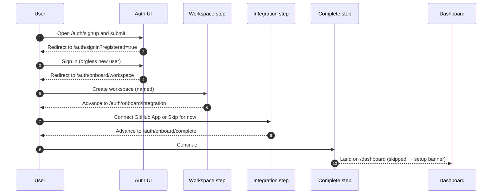
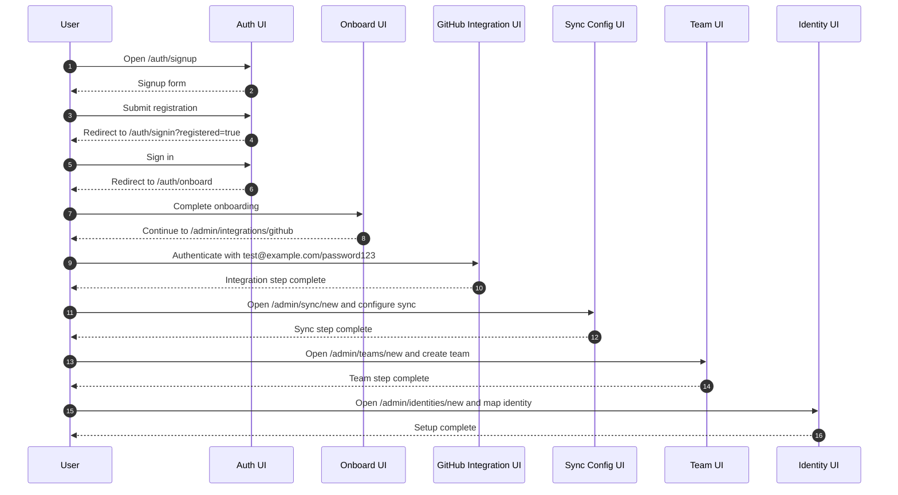

# E2E Spec: Onboarding Journeys

## Guided First-Run Onboarding (CHAOS-2670)

Purpose

- Encodes the guided first-run journey an ORGLESS new user walks before reaching the product.
- Gated by `NEXT_PUBLIC_GUIDED_ONBOARDING` (default off). When on, `/auth/onboard` reads the onboarding state server-side and redirects to the matching step route.

Primary test files

- `tests/auth-onboard.spec.ts` — guided journey against the mock backend (runs in the `onboarding-user` Playwright project on the flag-on dev server).
- `tests/live/onboarding-ui.spec.ts`, `tests/live/journey.spec.ts` — live-backend coverage of the orgless → onboarded transition.

Route sequence

- `/auth/signup`
- `/auth/signin?registered=true`
- `/auth/onboard/workspace`
- `/auth/onboard/integration`
- `/auth/onboard/complete`
- `/dashboard`

Step behavior

- Workspace: creating a workspace routes to the **integration** step (never straight to the dashboard). A blank or whitespace-only organization name is **rejected** and the user stays on the workspace step.
- Integration: leads with a **return-aware GitHub App install** — the install callback returns to `/auth/onboard/integration` so the guided flow resumes there. The user can also connect a secondary provider, paste a personal access token, or skip.
- Skip: persists the skip and advances to the completion step; the dashboard then shows the persistent "Integration setup skipped" setup banner.
- Complete: confirms setup and continues into `/dashboard`.

Flag-off behavior

- With `NEXT_PUBLIC_GUIDED_ONBOARDING` unset, `/auth/onboard` renders the legacy single-page workspace form and creating a workspace lands directly on the dashboard (see Full Account Setup below). The default Playwright suite asserts this legacy behavior; the guided journey runs on a dedicated flag-on dev server.

Test coverage

| Layer        | Coverage | Tests                                                            | Notes                                                                        |
| ------------ | -------- | ---------------------------------------------------------------- | ---------------------------------------------------------------------------- |
| Frontend E2E | ✅       | `tests/auth-onboard.spec.ts`                                     | Guided journey + blank-name rejection + GitHub App return path + skip path.  |
| Live E2E     | ✅       | `tests/live/onboarding-ui.spec.ts`, `tests/live/journey.spec.ts` | Orgless → onboarded transition against the live backend; no hidden auto-org. |

## Full Account Setup (7-Step Journey)

Purpose

- Covers the full initial setup progression from signup through identity mapping.
- Validates route transitions, post-registration signin, and required admin setup pages.
- Documents the **legacy / flag-off** admin-setup progression. When `NEXT_PUBLIC_GUIDED_ONBOARDING` is on, the onboard step is replaced by the [Guided First-Run Onboarding](#guided-first-run-onboarding-chaos-2670) route sequence above.

Primary test file

- `tests/account-creation-journey.spec.ts`

Actor model

- End user completing onboarding.
- Web application route layer.
- Admin setup pages for integrations, sync, team, and identities.

Route sequence

- `/auth/signup`
- `/auth/signin?registered=true`
- `/auth/onboard`
- `/admin/integrations/github`
- `/admin/sync/new`
- `/admin/teams/new`
- `/admin/identities/new`

Credential behavior in flow

- Steps 4 through 7 authenticate as `test@example.com` and `password123`.

Step-level checkpoints

- Step 1: Signup page renders and accepts account input.
- Step 2: Signin route includes `registered=true` query parameter.
- Step 3: Onboarding route loads as the post-auth continuation.
- Step 4: GitHub integration page is directly reachable and usable.
- Step 5: Sync configuration page is reachable after integration.
- Step 6: Team creation page is reachable for organizational setup.
- Step 7: Identity mapping page is reachable and completes setup chain.

Test coverage

| Layer         | Coverage | Tests                                    | Notes                                                                 |
| ------------- | -------- | ---------------------------------------- | --------------------------------------------------------------------- |
| Backend Unit  | —        | —                                        | No backend unit source listed for this exact 7-step route journey.    |
| Frontend Unit | —        | —                                        | Covered at end-to-end level instead of isolated component unit level. |
| Frontend E2E  | ✅       | `tests/account-creation-journey.spec.ts` | Core source of truth for the 7-step progression.                      |
| Live E2E      | ✅       | `tests/live/journey.spec.ts`             | Confirms full setup behavior against live stack.                      |

## Workspace Creation

Scope note

- Workspace creation is documented in the authentication system document.
- This journey is intentionally cross-referenced and not duplicated.

Canonical reference

- `docs/auth-system.md`

Diagram policy

- Diagram intentionally omitted for this section.
- Authentication domain flow ownership remains in `auth-system.md`.

Test coverage

| Layer         | Coverage     | Tests                | Notes                                                           |
| ------------- | ------------ | -------------------- | --------------------------------------------------------------- |
| Backend Unit  | See auth doc | See `auth-system.md` | Coverage is maintained in the dedicated auth documentation set. |
| Frontend Unit | See auth doc | See `auth-system.md` | This file does not duplicate auth journey test mapping.         |
| Frontend E2E  | See auth doc | See `auth-system.md` | Existing coverage remains authoritative there.                  |
| Live E2E      | See auth doc | See `auth-system.md` | Existing live coverage remains authoritative there.             |

Implementation note

- Any updates to workspace creation behavior should first update `auth-system.md`.

## Organization Invite Lifecycle

Scope note

- Organization invite lifecycle is documented in the authentication system document.
- This journey is intentionally cross-referenced and not duplicated.

Canonical reference

- `docs/auth-system.md`

Diagram policy

- Diagram intentionally omitted for this section.
- Invite acceptance and invitation-state details remain in the auth document.

Test coverage

| Layer         | Coverage     | Tests                | Notes                                                                |
| ------------- | ------------ | -------------------- | -------------------------------------------------------------------- |
| Backend Unit  | See auth doc | See `auth-system.md` | Invite backend behavior is tracked in the auth documentation domain. |
| Frontend Unit | See auth doc | See `auth-system.md` | Frontend invite unit mapping lives in auth documentation.            |
| Frontend E2E  | See auth doc | See `auth-system.md` | Invite e2e paths are tracked in auth documentation.                  |
| Live E2E      | See auth doc | See `auth-system.md` | Live invite lifecycle mapping is tracked in auth documentation.      |

Implementation note

- Keep this section as a pointer to avoid divergence between auth and onboarding docs.
