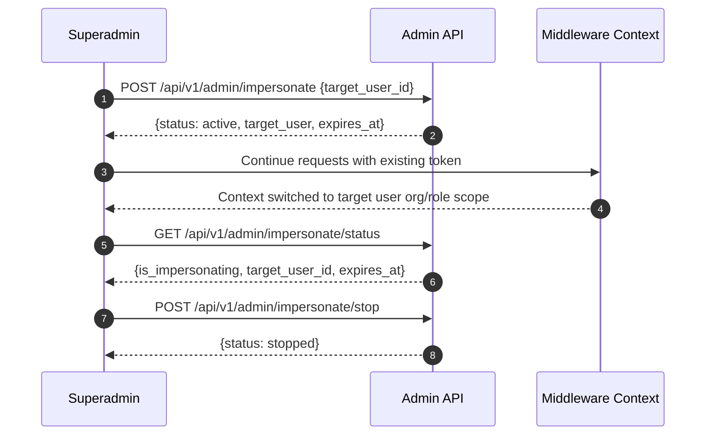
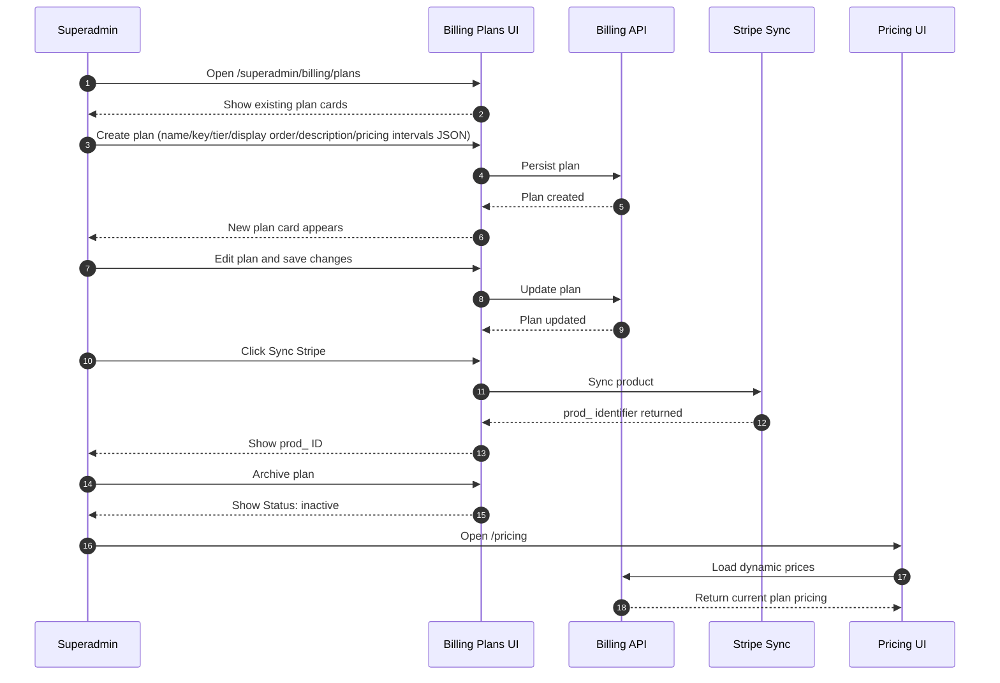
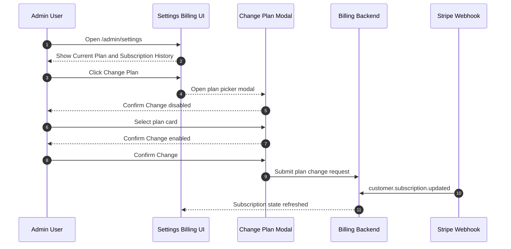
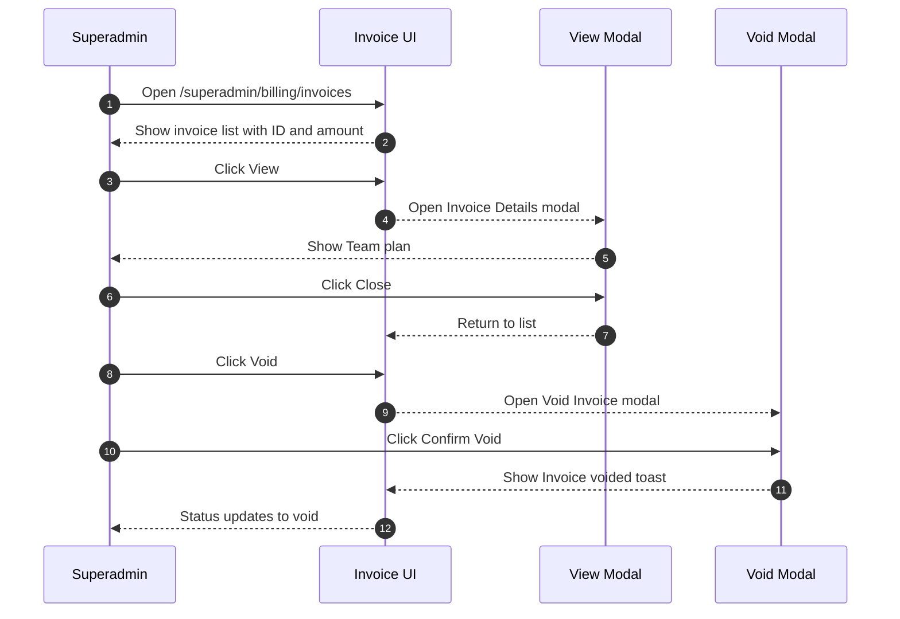
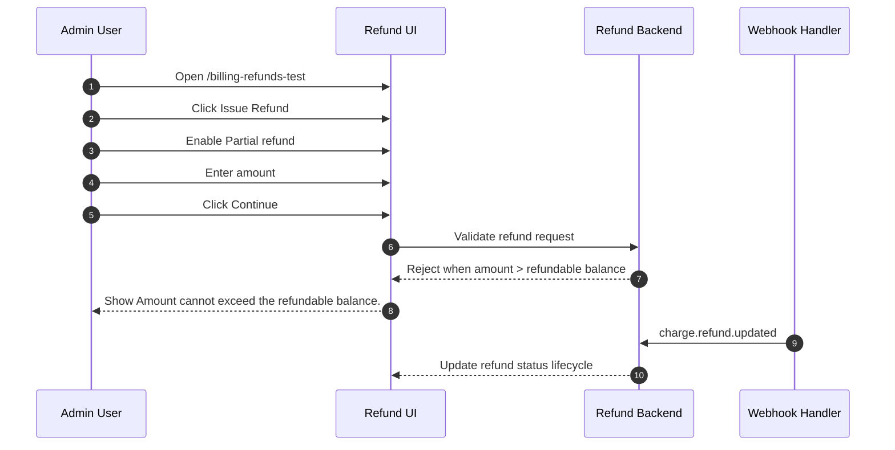
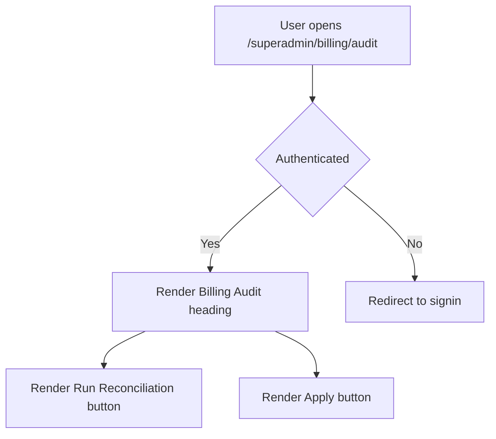
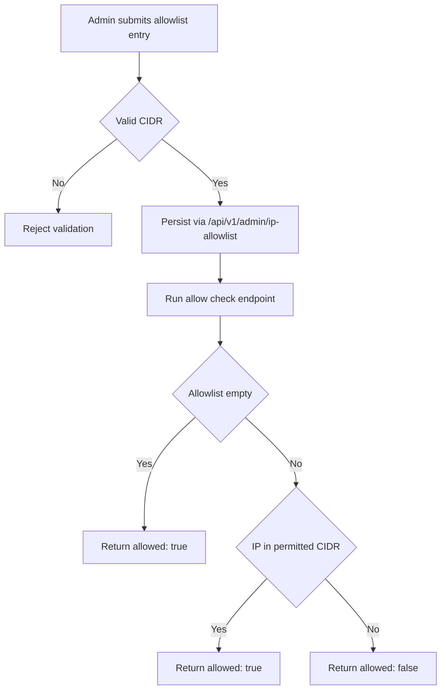
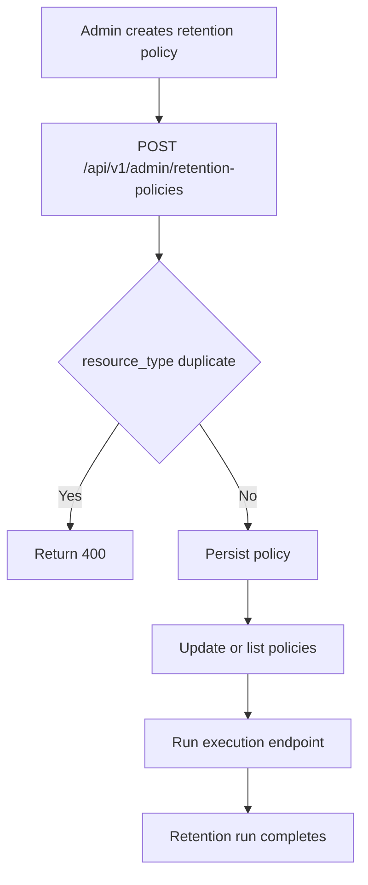
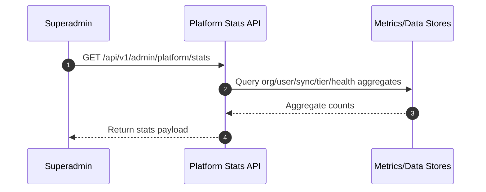

# E2E Spec: Platform Admin Journeys

## Impersonation Lifecycle

Purpose

- Covers superadmin impersonation start/status/stop API lifecycle.
- Documents middleware-based context swap behavior without token issuance.

Primary test files

- `tests/live/impersonation.spec.ts`
- `tests/api/admin/test_impersonation_endpoints.py`

API endpoints

- `POST /api/v1/admin/impersonate` with `{target_user_id}`
- `GET /api/v1/admin/impersonate/status`
- `POST /api/v1/admin/impersonate/stop`

Response contracts

- Start: `{status: "active", target_user: {id, email, org_id, role}, expires_at}`
- Status: `{is_impersonating: bool, target_user_id, expires_at}`
- Stop: `{status: "stopped"}`

Error contracts

- `403` for superuser to superuser impersonation attempt.
- `400` for self-impersonation attempt.
- `401/403` for unauthenticated or unauthorized access.

Security model

- No new token issued.
- Middleware performs context swap.



Test coverage

| Layer         | Coverage | Tests                                             | Notes                                                                           |
| ------------- | -------- | ------------------------------------------------- | ------------------------------------------------------------------------------- |
| Backend Unit  | ✅       | `tests/api/admin/test_impersonation_endpoints.py` | Unit coverage for endpoint contract and restriction rules.                      |
| Frontend Unit | ✅       | `src/lib/__tests__/access-matrix.test.ts`         | Frontend access matrix includes impersonation-aware feature resolution context. |
| Frontend E2E  | —        | —                                                 | No non-live frontend e2e source listed for impersonation UI flow.               |
| Live E2E      | ✅       | `tests/live/impersonation.spec.ts`                | Validates lifecycle behavior in live environment.                               |

## Billing Plan Management

Purpose

- Covers superadmin billing plan CRUD and Stripe product sync process.
- Validates pricing page consumption of billing API plan values.

Primary test files

- `tests/billing-plans.spec.ts`
- `tests/test_billing_plans.py`

Route

- `/superadmin/billing/plans`

Core lifecycle actions

- Create plan with fields: name, key, tier, display order, description, pricing intervals JSON.
- Confirm card appears.
- Edit plan and save changes.
- Trigger `Sync Stripe`.
- Confirm `prod_` identifier appears.
- Archive plan.
- Confirm `Status: inactive`.

Downstream dependency

- `/pricing` reflects billing API plan values dynamically.



Test coverage

| Layer         | Coverage | Tests                         | Notes                                                            |
| ------------- | -------- | ----------------------------- | ---------------------------------------------------------------- |
| Backend Unit  | ✅       | `tests/test_billing_plans.py` | Covers plan model and API behavior including sync-related logic. |
| Frontend Unit | —        | —                             | No dedicated billing plans unit test file listed.                |
| Frontend E2E  | ✅       | `tests/billing-plans.spec.ts` | Covers superadmin plan CRUD/sync/archive journey.                |
| Live E2E      | —        | —                             | No live e2e source listed for billing plans route.               |

## Subscription Management

Purpose

- Covers billing section subscription visibility and plan change modal behavior.
- Documents webhook-driven subscription state updates.

Primary test files

- `tests/billing-subscriptions.spec.ts`
- `tests/test_subscriptions.py`

Route

- `/admin/settings` (Billing section)

Expected billing section elements

- `Current Plan`
- `Subscription History`
- `Change Plan` button

Change Plan modal behavior

- Uses plan picker cards.
- Does not use raw price ID input.
- `Confirm Change` remains disabled until a plan is selected.

Backend event model

- Webhook-driven state changes via:
    - `customer.subscription.created`
    - `customer.subscription.updated`



Test coverage

| Layer         | Coverage | Tests                                 | Notes                                                           |
| ------------- | -------- | ------------------------------------- | --------------------------------------------------------------- |
| Backend Unit  | ✅       | `tests/test_subscriptions.py`         | Covers subscription state transitions and webhook effects.      |
| Frontend Unit | —        | —                                     | No dedicated unit test file listed for subscription modal path. |
| Frontend E2E  | ✅       | `tests/billing-subscriptions.spec.ts` | Covers billing section and change-plan modal interactions.      |
| Live E2E      | —        | —                                     | No live e2e source listed for subscription management.          |

## Invoice Management

Purpose

- Covers invoice list, details modal, and void flow lifecycle.
- Confirms status transition from active to void after confirmation.

Primary test file

- `tests/billing-invoices.spec.ts`

Route

- `/superadmin/billing/invoices`

Expected list details

- Invoice ID visible.
- Amount visible (example `$120.00`).

View flow

- Click `View`.
- `Invoice Details` modal opens.
- Displays `Team plan`.
- Close returns to list context.

Void flow

- Click `Void`.
- `Void Invoice` modal opens.
- Confirm via `Confirm Void`.
- `Invoice voided` toast appears.
- Row status updates to `void`.



Test coverage

| Layer         | Coverage | Tests                            | Notes                                                             |
| ------------- | -------- | -------------------------------- | ----------------------------------------------------------------- |
| Backend Unit  | —        | —                                | No backend unit invoice CRUD test listed in provided source set.  |
| Frontend Unit | —        | —                                | No frontend invoice unit test file listed in provided source set. |
| Frontend E2E  | ✅       | `tests/billing-invoices.spec.ts` | Covers listing, details modal, and void lifecycle.                |
| Live E2E      | —        | —                                | No live e2e source listed for invoice management route.           |

## Refund Validation

Purpose

- Covers refund initiation validation and backend refund constraints.
- Confirms partial refund validation against refundable balance.

Primary test files

- `tests/billing-refunds.spec.ts`
- `tests/test_refunds.py`

Route

- `/billing-refunds-test`

UI flow

- Click `Issue Refund`.
- Check `Partial refund`.
- Enter amount.
- Click `Continue`.
- Validation message appears: `Amount cannot exceed the refundable balance.`

Backend constraints

- Invoice must be paid.
- Refund amount must be `<= refundable balance`.
- Webhook `charge.refund.updated` drives status transitions.



Test coverage

| Layer         | Coverage | Tests                           | Notes                                                         |
| ------------- | -------- | ------------------------------- | ------------------------------------------------------------- |
| Backend Unit  | ✅       | `tests/test_refunds.py`         | Covers paid-invoice constraint and refundable amount bounds.  |
| Frontend Unit | —        | —                               | No frontend refund unit test file listed in provided sources. |
| Frontend E2E  | ✅       | `tests/billing-refunds.spec.ts` | Covers UI validation path for partial refund flow.            |
| Live E2E      | —        | —                               | No live e2e source listed for refund validation route.        |

## Billing Audit

Purpose

- Covers billing audit console route and unauthenticated fallback behavior.
- Documents reconciliation control surface on superadmin page.

Primary test file

- `tests/billing-audit.spec.ts`

Route

- `/superadmin/billing/audit`

Expected controls

- `Billing Audit` heading.
- `Run Reconciliation` button.
- `Apply` button.

Auth fallback behavior

- Unauthenticated requests redirect to signin route.



Test coverage

| Layer         | Coverage | Tests                         | Notes                                                               |
| ------------- | -------- | ----------------------------- | ------------------------------------------------------------------- |
| Backend Unit  | —        | —                             | No backend unit source listed for billing audit endpoints or logic. |
| Frontend Unit | —        | —                             | No frontend unit source listed for billing audit page.              |
| Frontend E2E  | ✅       | `tests/billing-audit.spec.ts` | Covers route content and unauthenticated fallback behavior.         |
| Live E2E      | —        | —                             | No live e2e source listed for billing audit journey.                |

## IP Allowlisting

Purpose

- Covers admin IP allowlist CRUD and allow check endpoint behavior.
- Documents validation and default-open behavior for empty allowlist.

Primary test files

- `tests/api/admin/test_ip_allowlist.py`
- `src/lib/admin/__tests__/server.test.ts`

API scope

- CRUD operations on `/api/v1/admin/ip-allowlist`.
- Check endpoint confirms allow decision.

Validation rules

- CIDR notation is required.
- Empty allowlist means all IPs are allowed.
- Check response includes `allowed: true/false`.

Frontend integration source

- Server action coverage in `src/lib/admin/__tests__/server.test.ts`.



Test coverage

| Layer         | Coverage | Tests                                    | Notes                                                       |
| ------------- | -------- | ---------------------------------------- | ----------------------------------------------------------- |
| Backend Unit  | ✅       | `tests/api/admin/test_ip_allowlist.py`   | Covers CRUD, CIDR validation, and check endpoint semantics. |
| Frontend Unit | ✅       | `src/lib/admin/__tests__/server.test.ts` | Covers server action integration points for admin controls. |
| Frontend E2E  | —        | —                                        | No frontend e2e source listed for allowlist UI workflow.    |
| Live E2E      | —        | —                                        | No live e2e source listed for IP allowlisting.              |

## Retention Policies

Purpose

- Covers retention policy CRUD and execution endpoint behavior.
- Documents duplicate resource-type rejection rule.

Primary test files

- `tests/api/admin/test_retention.py`
- `src/lib/admin/__tests__/server.test.ts`

API scope

- CRUD operations on `/api/v1/admin/retention-policies`.
- Payload shape includes `{resource_type, retention_days}`.
- Execution endpoint triggers retention action.

Validation rules

- Duplicate `resource_type` returns `400`.

Frontend integration source

- Server action coverage in `src/lib/admin/__tests__/server.test.ts`.



Test coverage

| Layer         | Coverage | Tests                                    | Notes                                                             |
| ------------- | -------- | ---------------------------------------- | ----------------------------------------------------------------- |
| Backend Unit  | ✅       | `tests/api/admin/test_retention.py`      | Covers CRUD behavior, duplicate constraints, and execution path.  |
| Frontend Unit | ✅       | `src/lib/admin/__tests__/server.test.ts` | Covers server action integration for retention policy operations. |
| Frontend E2E  | —        | —                                        | No frontend e2e source listed for retention policy UI flow.       |
| Live E2E      | —        | —                                        | No live e2e source listed for retention policy management.        |

## Platform Stats

Purpose

- Covers platform-level aggregate stats endpoint for admin observability.
- Documents expected count categories and health metrics returned.

Primary test file

- `tests/test_platform_stats.py`

API endpoint

- `GET /api/v1/admin/platform/stats`

Returned domains

- Organization counts.
- User counts: total, active, superuser.
- Sync configuration counts.
- Tier distribution.
- Sync health counts: success and failed.



Test coverage

| Layer         | Coverage | Tests                          | Notes                                                     |
| ------------- | -------- | ------------------------------ | --------------------------------------------------------- |
| Backend Unit  | ✅       | `tests/test_platform_stats.py` | Covers endpoint payload structure and aggregate values.   |
| Frontend Unit | —        | —                              | No frontend stats consumer test listed.                   |
| Frontend E2E  | —        | —                              | No frontend e2e source listed for platform stats display. |
| Live E2E      | —        | —                              | No live e2e source listed for this endpoint flow.         |

## Tier Feature Gating

Purpose

- Covers tier-based access control at backend decorator and frontend gating layers.
- Documents impersonation interaction with target organization tier visibility.

Primary test files

- `tests/test_community_features.py`
- `src/lib/__tests__/access-matrix.test.ts`

Tier model

- `community`
- `team`
- `enterprise`

Backend enforcement

- `@require_feature` decorator checks `Organization.tier`.
- Community tier receives `403` on enterprise-only features.

Frontend enforcement

- `UpgradeGate` component controls gated content.
- `AdminSidebar` filters items by `featureKey`.

Impersonation behavior

- Superuser sees feature availability resolved using target organization tier.

```mermaid
flowchart TD
    U[User requests feature] --> B[@require_feature checks Organization.tier]
    B --> T{Tier supports feature}
    T -- Yes --> OK[Allow backend action]
    T -- No --> F403[Return 403]
    OK --> FE[Frontend route loads]
    FE --> G[UpgradeGate evaluates feature]
    G --> S[AdminSidebar filters by featureKey]
    S --> V[Render only allowed items]
    I[If impersonating] --> TI[Resolve tier from target org]
    TI --> G
```

Test coverage

| Layer         | Coverage | Tests                                     | Notes                                                              |
| ------------- | -------- | ----------------------------------------- | ------------------------------------------------------------------ |
| Backend Unit  | ✅       | `tests/test_community_features.py`        | Covers backend decorator behavior across tiers.                    |
| Frontend Unit | ✅       | `src/lib/__tests__/access-matrix.test.ts` | Covers frontend access matrix and gating semantics.                |
| Frontend E2E  | —        | —                                         | No frontend e2e source listed for tier gating navigation behavior. |
| Live E2E      | —        | —                                         | No live e2e source listed for tier gating.                         |
