# User Journeys
> Comprehensive documentation of all user-facing flows across the Dev Health platform.
> For authentication journeys (registration, login, verification, SSO, RBAC), see [auth-system.md](auth-system.md).
## Table of Contents
- [1. Onboarding Journeys](#1-onboarding-journeys)
  - [1.1 Full Account Setup (7-Step Journey)](#11-full-account-setup-7-step-journey)
  - [1.2 Workspace Creation](#12-workspace-creation)
  - [1.3 Organization Invite Lifecycle](#13-organization-invite-lifecycle)
- [2. Account Admin Journeys](#2-account-admin-journeys)
  - [2.1 Integration Setup](#21-integration-setup)
  - [2.2 Sync Configuration](#22-sync-configuration)
  - [2.3 Team Management](#23-team-management)
  - [2.4 Identity Mapping](#24-identity-mapping)
  - [2.5 Organization Settings](#25-organization-settings)
- [3. Account User Journeys](#3-account-user-journeys)
  - [3.1 Dashboard Landing & Drill-down](#31-dashboard-landing--drill-down)
  - [3.2 Work Tabbed Navigation](#32-work-tabbed-navigation)
  - [3.3 Filter Propagation](#33-filter-propagation)
  - [3.4 People Search & Individual Views](#34-people-search--individual-views)
  - [3.5 Chart Interactions](#35-chart-interactions)
  - [3.6 Deployment Flame View](#36-deployment-flame-view)
  - [3.7 Marketing & Pricing Pages](#37-marketing--pricing-pages)
- [4. Platform Admin Journeys](#4-platform-admin-journeys)
  - [4.1 Impersonation Lifecycle](#41-impersonation-lifecycle)
  - [4.2 Billing Plan Management](#42-billing-plan-management)
  - [4.3 Subscription Management](#43-subscription-management)
  - [4.4 Invoice Management](#44-invoice-management)
  - [4.5 Refund Validation](#45-refund-validation)
  - [4.6 Billing Audit](#46-billing-audit)
  - [4.7 IP Allowlisting](#47-ip-allowlisting)
  - [4.8 Retention Policies](#48-retention-policies)
  - [4.9 Platform Stats](#49-platform-stats)
  - [4.10 Tier Feature Gating](#410-tier-feature-gating)
- [5. Test Coverage Summary](#5-test-coverage-summary)
  - [5.1 Master Coverage Matrix](#51-master-coverage-matrix)
  - [5.2 Coverage Gaps](#52-coverage-gaps)
## 1. Onboarding Journeys
### 1.1 Full Account Setup (7-Step Journey)
Purpose
- Covers the full initial setup progression from signup through identity mapping.
- Validates route transitions, post-registration signin, and required admin setup pages.
Primary test file
- `tests/account-creation-journey.spec.ts`
Actor model
- End user completing onboarding.
- Web application route layer.
- Admin setup pages for integrations, sync, team, and identities.
Route sequence
- `/auth/signup`
- `/auth/signin?registered=true`
- `/auth/onboard`
- `/admin/integrations/github`
- `/admin/sync/new`
- `/admin/teams/new`
- `/admin/identities/new`
Credential behavior in flow
- Steps 4 through 7 authenticate as `test@example.com` and `password123`.
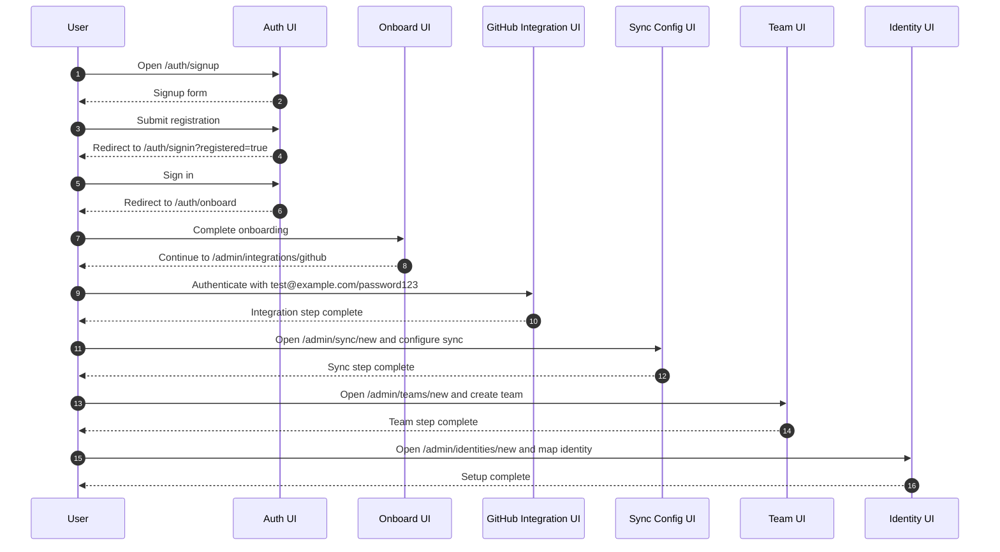
```mermaid
sequenceDiagram
    autonumber
    participant U as User
    participant A as Auth UI
    participant O as Onboard UI
    participant GI as GitHub Integration UI
    participant SY as Sync Config UI
    participant TM as Team UI
    participant ID as Identity UI
    U->>A: Open /auth/signup
    A-->>U: Signup form
    U->>A: Submit registration
    A-->>U: Redirect to /auth/signin?registered=true
    U->>A: Sign in
    A-->>U: Redirect to /auth/onboard
    U->>O: Complete onboarding
    O-->>U: Continue to /admin/integrations/github
    U->>GI: Authenticate with test@example.com/password123
    GI-->>U: Integration step complete
    U->>SY: Open /admin/sync/new and configure sync
    SY-->>U: Sync step complete
    U->>TM: Open /admin/teams/new and create team
    TM-->>U: Team step complete
    U->>ID: Open /admin/identities/new and map identity
    ID-->>U: Setup complete
```
Step-level checkpoints
- Step 1: Signup page renders and accepts account input.
- Step 2: Signin route includes `registered=true` query parameter.
- Step 3: Onboarding route loads as the post-auth continuation.
- Step 4: GitHub integration page is directly reachable and usable.
- Step 5: Sync configuration page is reachable after integration.
- Step 6: Team creation page is reachable for organizational setup.
- Step 7: Identity mapping page is reachable and completes setup chain.
Test coverage
| Layer | Coverage | Tests | Notes |
|---|---|---|---|
| Backend Unit | — | — | No backend unit source listed for this exact 7-step route journey. |
| Frontend Unit | — | — | Covered at end-to-end level instead of isolated component unit level. |
| Frontend E2E | ✅ | `tests/account-creation-journey.spec.ts` | Core source of truth for the 7-step progression. |
| Live E2E | ✅ | `tests/live/journey.spec.ts` | Confirms full setup behavior against live stack. |
### 1.2 Workspace Creation
Scope note
- Workspace creation is documented in the authentication system document.
- This journey is intentionally cross-referenced and not duplicated.
Canonical reference
- `docs/auth-system.md`
Diagram policy
- Diagram intentionally omitted for this section.
- Authentication domain flow ownership remains in `auth-system.md`.
Test coverage
| Layer | Coverage | Tests | Notes |
|---|---|---|---|
| Backend Unit | See auth doc | See `auth-system.md` | Coverage is maintained in the dedicated auth documentation set. |
| Frontend Unit | See auth doc | See `auth-system.md` | This file does not duplicate auth journey test mapping. |
| Frontend E2E | See auth doc | See `auth-system.md` | Existing coverage remains authoritative there. |
| Live E2E | See auth doc | See `auth-system.md` | Existing live coverage remains authoritative there. |
Implementation note
- Any updates to workspace creation behavior should first update `auth-system.md`.
### 1.3 Organization Invite Lifecycle
Scope note
- Organization invite lifecycle is documented in the authentication system document.
- This journey is intentionally cross-referenced and not duplicated.
Canonical reference
- `docs/auth-system.md`
Diagram policy
- Diagram intentionally omitted for this section.
- Invite acceptance and invitation-state details remain in the auth document.
Test coverage
| Layer | Coverage | Tests | Notes |
|---|---|---|---|
| Backend Unit | See auth doc | See `auth-system.md` | Invite backend behavior is tracked in the auth documentation domain. |
| Frontend Unit | See auth doc | See `auth-system.md` | Frontend invite unit mapping lives in auth documentation. |
| Frontend E2E | See auth doc | See `auth-system.md` | Invite e2e paths are tracked in auth documentation. |
| Live E2E | See auth doc | See `auth-system.md` | Live invite lifecycle mapping is tracked in auth documentation. |
Implementation note
- Keep this section as a pointer to avoid divergence between auth and onboarding docs.
## 2. Account Admin Journeys
### 2.1 Integration Setup
Purpose
- Covers provider credential setup and connection testing from admin integration pages.
- Confirms route handling for known and unknown providers.
Primary test files
- `tests/admin-integrations.spec.ts`
- `src/components/admin/integrations/IntegrationForm.test.tsx`
Core routes
- `/admin/integrations`
- `/admin/integrations/[provider]`
Supported provider route examples
- `/admin/integrations/github`
- `/admin/integrations/gitlab`
- `/admin/integrations/jira`
- `/admin/integrations/linear`
Form fields by provider
- GitHub: `#github-token`, `#github-org`, `#github-repos`
- GitLab: `#gitlab-token`, `#gitlab-group`
- Jira: `#jira-url`, `#jira-email`, `#jira-token`, `#jira-projects`
- Linear: `#linear-key`, `#linear-teams`
Server actions
- `createCredential` in `src/lib/admin/server.ts`
- `testConnection` in `src/lib/admin/server.ts`
Decision and routing flow
```mermaid
flowchart TD
    U[User opens /admin/integrations] --> C[Select provider card]
    C --> P{Provider known}
    P -- Yes --> F[Load /admin/integrations/[provider] form]
    P -- No --> N[Return 404]
    F --> I[Enter provider-specific fields]
    I --> S[Click Save Changes]
    S --> SC[createCredential server action]
    SC --> T1[Show success toast]
    I --> T[Click Test Connection]
    T --> TC[testConnection server action]
    TC --> T2[Show Connection successful]
```
Test coverage
| Layer | Coverage | Tests | Notes |
|---|---|---|---|
| Backend Unit | ✅ | `test_admin_credentials.py` | Backend credential handling and related logic are unit-covered. |
| Frontend Unit | ✅ | `src/components/admin/integrations/IntegrationForm.test.tsx` | Validates form rendering and interaction behavior by provider. |
| Frontend E2E | ✅ | `tests/admin-integrations.spec.ts`, `tests/account-creation-journey.spec.ts` (step 4) | Confirms UI flow and inclusion in full setup journey. |
| Live E2E | ✅ | `tests/live/journey.spec.ts` | Validates integration step in live journey context. |
### 2.2 Sync Configuration
Purpose
- Covers create/edit/list lifecycle for sync configuration records.
- Verifies provider-aware sync target toggles and manual trigger action.
Primary test files
- `tests/admin-sync.spec.ts`
- `src/components/admin/sync/SyncConfigForm.test.tsx`
Routes
- `/admin/sync`
- `/admin/sync/new`
- `/admin/sync/[configId]`
Required fields
- `#name`
- `#provider` (select)
- `#credential_id` (select)
Provider target toggles
- GitHub: Git Data, PRs, CI/CD, Deployments
- Jira: Work Items
Trigger action
- `triggerSync(configId)` server action
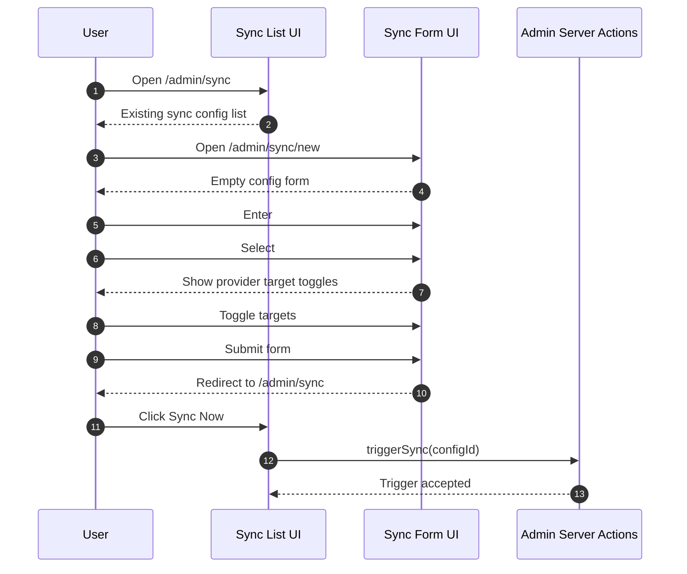
```mermaid
sequenceDiagram
    autonumber
    participant U as User
    participant L as Sync List UI
    participant F as Sync Form UI
    participant SA as Admin Server Actions
    U->>L: Open /admin/sync
    L-->>U: Existing sync config list
    U->>F: Open /admin/sync/new
    F-->>U: Empty config form
    U->>F: Enter #name
    U->>F: Select #provider and #credential_id
    F-->>U: Show provider target toggles
    U->>F: Toggle targets
    U->>F: Submit form
    F-->>U: Redirect to /admin/sync
    U->>L: Click Sync Now
    L->>SA: triggerSync(configId)
    SA-->>L: Trigger accepted
```
Test coverage
| Layer | Coverage | Tests | Notes |
|---|---|---|---|
| Backend Unit | ✅ | `test_sync_configs.py` | Covers backend sync config lifecycle semantics. |
| Frontend Unit | ✅ | `src/components/admin/sync/SyncConfigForm.test.tsx` | Covers provider-target toggles and form-level behavior. |
| Frontend E2E | ✅ | `tests/admin-sync.spec.ts`, `tests/account-creation-journey.spec.ts` (step 5) | Covers dedicated sync flow and onboarding integration. |
| Live E2E | ✅ | `tests/live/journey.spec.ts` | Covers sync path in live account setup journey. |
### 2.3 Team Management
Purpose
- Covers team create/edit/list operations and validation behavior.
- Ensures cancel and create navigation paths are deterministic.
Primary test files
- `tests/admin-teams.spec.ts`
- `src/components/admin/teams/TeamForm.test.tsx`
Routes
- `/admin/teams`
- `/admin/teams/new`
- `/admin/teams/[teamId]`
Team form fields
- `#team_id` (slug, disabled in edit)
- `#name`
- `#description`
- `#repo_patterns`
- `#project_keys`
Validation constraints
- `team_id` required.
- `name` required.
- Native browser validation path is used.
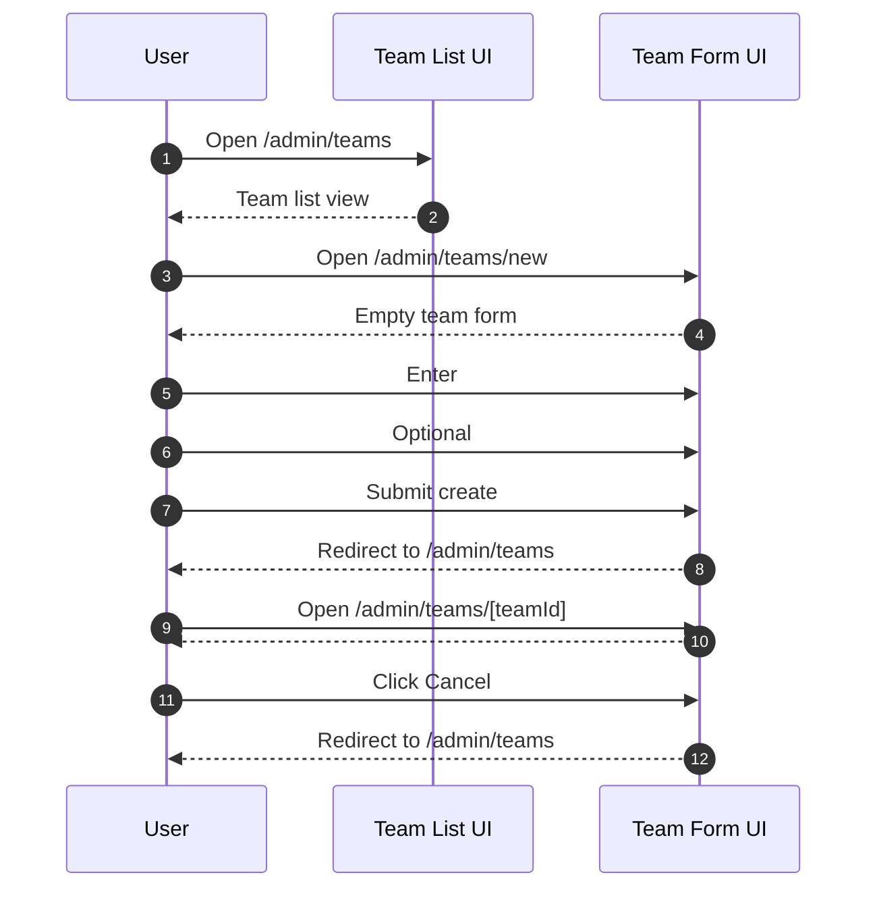
```mermaid
sequenceDiagram
    autonumber
    participant U as User
    participant TL as Team List UI
    participant TF as Team Form UI
    U->>TL: Open /admin/teams
    TL-->>U: Team list view
    U->>TF: Open /admin/teams/new
    TF-->>U: Empty team form
    U->>TF: Enter #team_id and #name
    U->>TF: Optional #description, #repo_patterns, #project_keys
    U->>TF: Submit create
    TF-->>U: Redirect to /admin/teams
    U->>TF: Open /admin/teams/[teamId]
    TF-->>U: #team_id disabled in edit mode
    U->>TF: Click Cancel
    TF-->>U: Redirect to /admin/teams
```
Test coverage
| Layer | Coverage | Tests | Notes |
|---|---|---|---|
| Backend Unit | ✅ | `test_teams.py` | Backend team model and CRUD behavior are covered. |
| Frontend Unit | ✅ | `src/components/admin/teams/TeamForm.test.tsx` | Validates field constraints and edit-mode behavior. |
| Frontend E2E | ✅ | `tests/admin-teams.spec.ts`, `tests/account-creation-journey.spec.ts` (step 6) | Confirms route and flow behavior through browser path. |
| Live E2E | — | — | No live e2e source listed for standalone team management. |
### 2.4 Identity Mapping
Purpose
- Covers canonical identity creation and provider identity attachment.
- Validates add-row behavior for multi-provider identity mapping.
Primary test files
- `tests/admin-identities.spec.ts`
- `src/components/admin/identities/IdentityForm.test.tsx`
Routes
- `/admin/identities`
- `/admin/identities/new`
Form fields
- `#canonical_id`
- `#display_name`
- `#email`
- Team selector
Dynamic row behavior
- `+ Add Identity` adds provider identity row.
- Each added row includes provider select and username input.
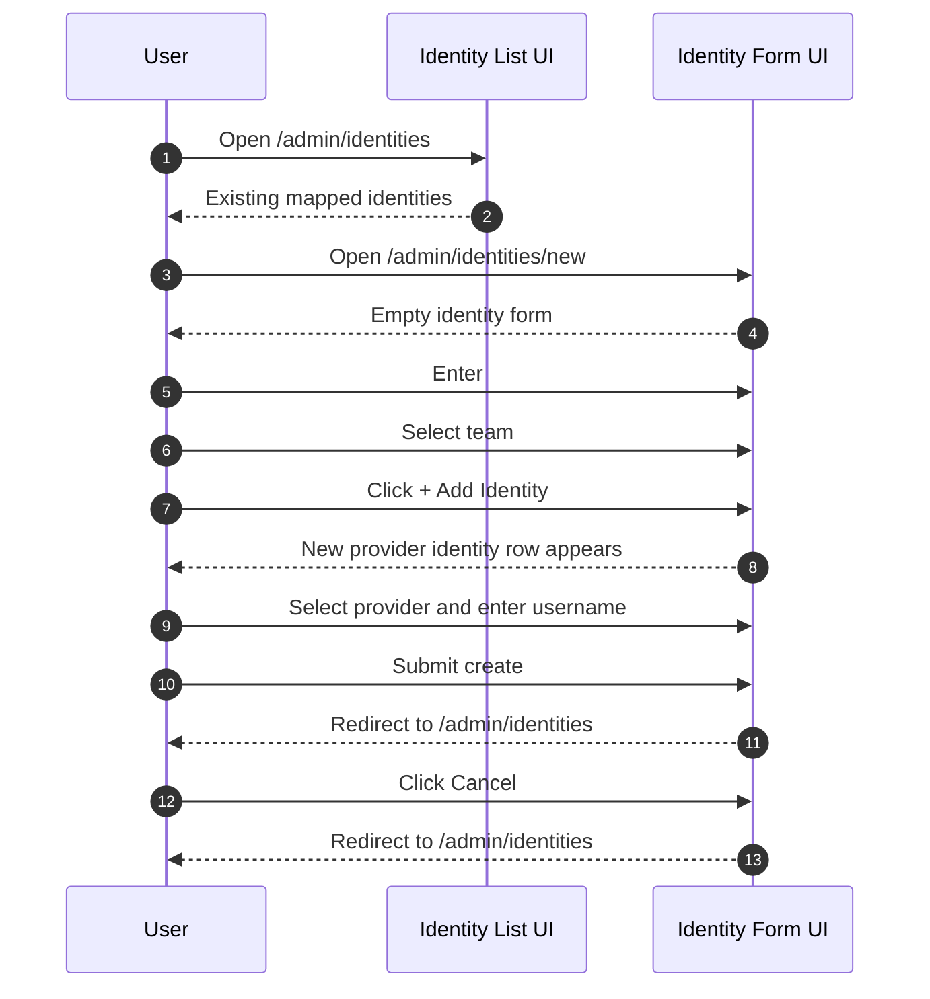
```mermaid
sequenceDiagram
    autonumber
    participant U as User
    participant IL as Identity List UI
    participant IF as Identity Form UI
    U->>IL: Open /admin/identities
    IL-->>U: Existing mapped identities
    U->>IF: Open /admin/identities/new
    IF-->>U: Empty identity form
    U->>IF: Enter #canonical_id, #display_name, #email
    U->>IF: Select team
    U->>IF: Click + Add Identity
    IF-->>U: New provider identity row appears
    U->>IF: Select provider and enter username
    U->>IF: Submit create
    IF-->>U: Redirect to /admin/identities
    U->>IF: Click Cancel
    IF-->>U: Redirect to /admin/identities
```
Test coverage
| Layer | Coverage | Tests | Notes |
|---|---|---|---|
| Backend Unit | ✅ | `test_identities.py` | Covers identity persistence and relationship semantics. |
| Frontend Unit | ✅ | `src/components/admin/identities/IdentityForm.test.tsx` | Covers dynamic row behavior and form interactions. |
| Frontend E2E | ✅ | `tests/admin-identities.spec.ts`, `tests/account-creation-journey.spec.ts` (step 7) | Confirms identity flow and inclusion in account setup journey. |
| Live E2E | — | — | No dedicated live e2e listed for standalone identity management. |
### 2.5 Organization Settings
Purpose
- Covers organization-level settings with emphasis on general info updates.
- Documents available sections and billing/security/danger controls presence.
Primary test file
- `tests/admin-settings.spec.ts`
Route
- `/admin/settings`
Sections on page
- General section (org name, slug disabled)
- Billing section (Upgrade/Change Plan button)
- Security section
- Danger Zone (Delete Organization)
Primary update action
- Update org name.
- Click `Save Changes`.
- Success toast confirms update.
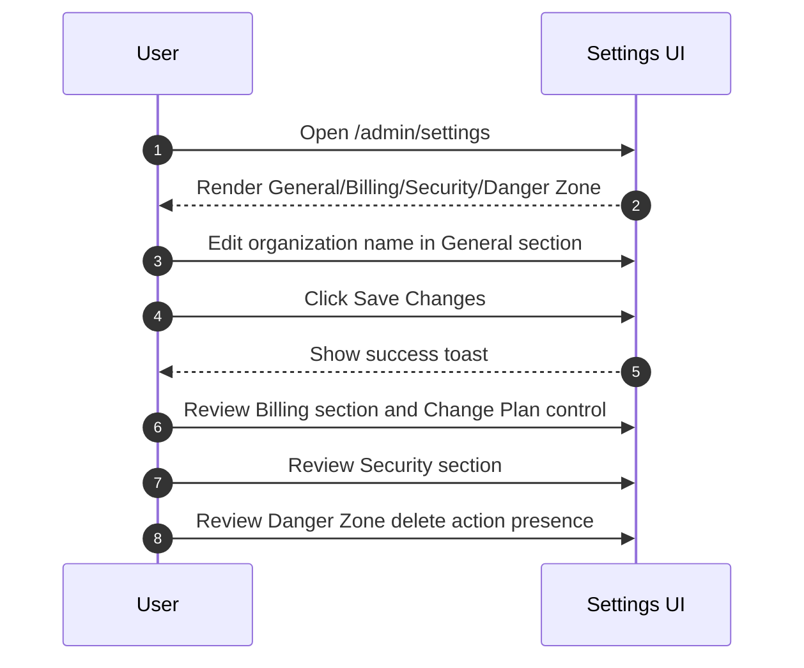
```mermaid
sequenceDiagram
    autonumber
    participant U as User
    participant S as Settings UI
    U->>S: Open /admin/settings
    S-->>U: Render General/Billing/Security/Danger Zone
    U->>S: Edit organization name in General section
    U->>S: Click Save Changes
    S-->>U: Show success toast
    U->>S: Review Billing section and Change Plan control
    U->>S: Review Security section
    U->>S: Review Danger Zone delete action presence
```
Test coverage
| Layer | Coverage | Tests | Notes |
|---|---|---|---|
| Backend Unit | — | — | No backend settings CRUD unit coverage listed in provided sources. |
| Frontend Unit | — | — | No unit test file listed for this page component path. |
| Frontend E2E | ✅ | `tests/admin-settings.spec.ts` | Covers UI sections and update feedback behavior. |
| Live E2E | — | — | No live e2e source listed for settings page. |
## 3. Account User Journeys
### 3.1 Dashboard Landing & Drill-down
Purpose
- Covers dashboard entry, tile drill-down, evidence panel, and explore deep-linking.
- Verifies filter parameter continuity into explore route.
Primary test file
- `tests/home-flow.spec.ts`
Routes
- `/` with heading `Developer Health Ops Cockpit`
- `/explore?metric=...&f=...`
- `/opportunities` with heading `Focus Cards`
Core interaction chain
- Open dashboard.
- Click delta tile.
- Evidence panel opens.
- Click `Open in Explore View ↗`.
- Navigate to explore route with `metric` and preserved `f`.
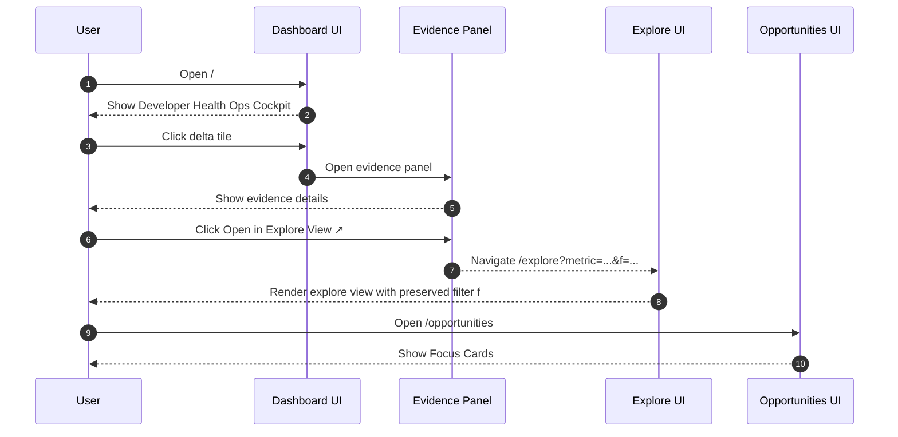
```mermaid
sequenceDiagram
    autonumber
    participant U as User
    participant D as Dashboard UI
    participant EP as Evidence Panel
    participant EX as Explore UI
    participant OP as Opportunities UI
    U->>D: Open /
    D-->>U: Show Developer Health Ops Cockpit
    U->>D: Click delta tile
    D->>EP: Open evidence panel
    EP-->>U: Show evidence details
    U->>EP: Click Open in Explore View ↗
    EP-->>EX: Navigate /explore?metric=...&f=...
    EX-->>U: Render explore view with preserved filter f
    U->>OP: Open /opportunities
    OP-->>U: Show Focus Cards
```
Test coverage
| Layer | Coverage | Tests | Notes |
|---|---|---|---|
| Backend Unit | — | — | No backend unit source listed for dashboard drill-down flow. |
| Frontend Unit | — | — | No component unit source listed for this journey. |
| Frontend E2E | ✅ | `tests/home-flow.spec.ts` | Route and deep-link continuity are covered end-to-end. |
| Live E2E | — | — | No live e2e source listed for this journey. |
### 3.2 Work Tabbed Navigation
Purpose
- Covers tab-specific rendering, URL tab routing, and investigation deep links.
- Verifies persistence of filter state across tab switches.
Primary test file
- `tests/work-navigation.spec.ts`
Route contract
- `/work?tab=[landscape|heatmap|flow|investment|flame]`
Tab expectations
- Default tab `landscape` renders `Investment Mix`.
- `heatmap` renders `Review wait density`.
- `flow` renders `Investment Mix` and `flow-chart-container`.
- `investment` renders `Work Unit Investment` and `Treemap`.
- `flame` renders `Elapsed Time Breakdown` and `chart-flame`.
Investigation routes
- Quadrant entity click then `View Flow` to `/work?tab=flow&context_entity_id=...`.
- Flow view shows `Filtering flow by` text.
- Flame deep-link `/work?tab=flame&mode=throughput&context_node=Backend`.
- Deep-link shows `Context: Analyzing decomposition starting from node`.
```mermaid
flowchart TD
    U[User opens /work] --> D{tab param present}
    D -- No --> L[Load default landscape tab]
    D -- Yes --> T[Load selected tab]
    L --> H1[Show Investment Mix]
    T --> K{Tab value}
    K -- heatmap --> H2[Show Review wait density]
    K -- flow --> F1[Show Investment Mix and flow-chart-container]
    K -- investment --> I1[Show Work Unit Investment and Treemap]
    K -- flame --> FL1[Show Elapsed Time Breakdown and chart-flame]
    F1 --> Q[Quadrant panel entity click]
    Q --> VF[View Flow link]
    VF --> F2[/work?tab=flow&context_entity_id=...]
    F2 --> FX[Show Filtering flow by]
    FL1 --> DL[/work?tab=flame&mode=throughput&context_node=Backend]
    DL --> CX[Show Context: Analyzing decomposition starting from node]
```
Test coverage
| Layer | Coverage | Tests | Notes |
|---|---|---|---|
| Backend Unit | — | — | No backend unit source listed for client-side tab routing flow. |
| Frontend Unit | — | — | No tab component unit source listed in provided data. |
| Frontend E2E | ✅ | `tests/work-navigation.spec.ts` | Covers all tab modes and context deep-links. |
| Live E2E | — | — | No live e2e source listed for tabbed work navigation. |
### 3.3 Filter Propagation
Purpose
- Covers cross-route filter continuity through shared navigation.
- Validates that encoded filter query parameter is identical after navigation.
Primary test file
- `tests/filter-propagation.spec.ts`
Primary routes in scope
- `/dashboard`
- `/people`
- `/metrics`
- `/explore/landscape`
- `/work`
- `/code`
- `/opportunities`
Additional route in scope
- `/metrics?tab=dora`
Flow behavior
- Open `Filters` panel.
- Expand `Who`.
- Fill developer filter.
- Collapse filter group.
- Navigate via `aside nav`.
- Confirm `f` query parameter is identical on destination routes.
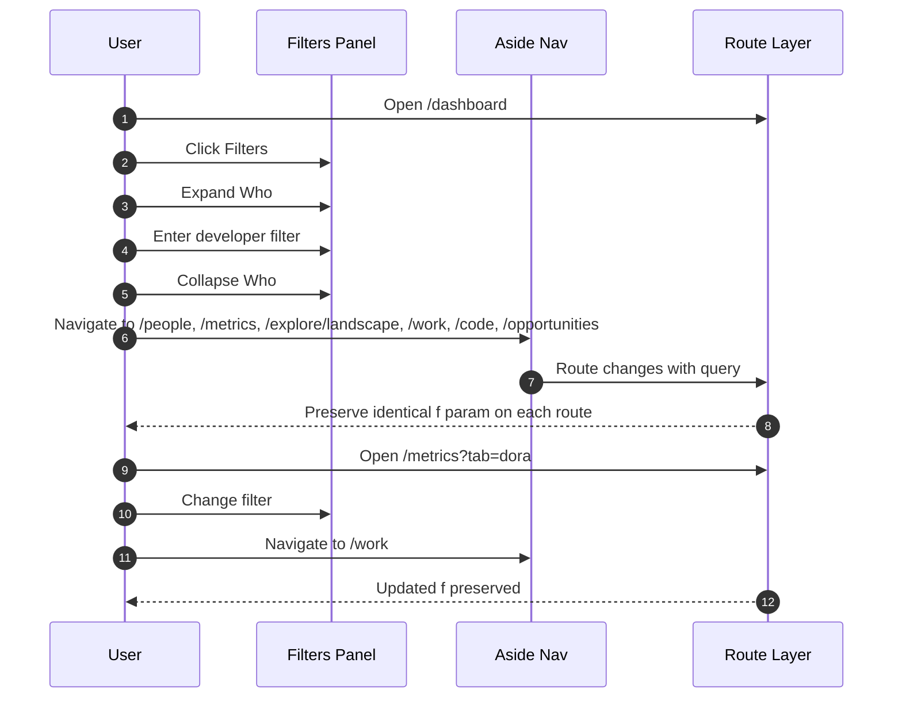
```mermaid
sequenceDiagram
    autonumber
    participant U as User
    participant FP as Filters Panel
    participant NAV as Aside Nav
    participant R as Route Layer
    U->>R: Open /dashboard
    U->>FP: Click Filters
    U->>FP: Expand Who
    U->>FP: Enter developer filter
    U->>FP: Collapse Who
    U->>NAV: Navigate to /people, /metrics, /explore/landscape, /work, /code, /opportunities
    NAV->>R: Route changes with query
    R-->>U: Preserve identical f param on each route
    U->>R: Open /metrics?tab=dora
    U->>FP: Change filter
    U->>NAV: Navigate to /work
    R-->>U: Updated f preserved
```
Test coverage
| Layer | Coverage | Tests | Notes |
|---|---|---|---|
| Backend Unit | — | — | No backend unit source listed for URL-only propagation behavior. |
| Frontend Unit | — | — | No dedicated unit coverage listed for global filter shell behavior. |
| Frontend E2E | ✅ | `tests/filter-propagation.spec.ts` | Source of truth for end-to-end URL preservation behavior. |
| Live E2E | — | — | No live e2e source listed for filter propagation journey. |
### 3.4 People Search & Individual Views
Purpose
- Covers people search, person detail route, metric drill-in, and evidence listing.
- Enforces language guardrail against comparative performance framing.
Primary test file
- `tests/people.spec.ts`
Route sequence
- `/people?q=alex`
- `/people/person-123`
- `/people/person-123/metrics/cycle_time`
Interaction chain
- Search by query parameter.
- Open person profile.
- Verify `Individual view` context.
- Open `Cycle Time` metric detail.
- Open `PRs` evidence section with heading and table.
Guardrail terms excluded
- `rank`
- `percentile`
- `top performer`
- `bottom performer`
- `score`
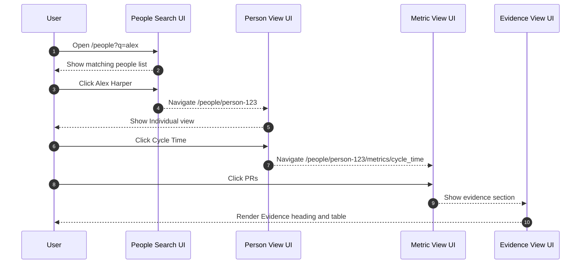
```mermaid
sequenceDiagram
    autonumber
    participant U as User
    participant PS as People Search UI
    participant PV as Person View UI
    participant MV as Metric View UI
    participant EV as Evidence View UI
    U->>PS: Open /people?q=alex
    PS-->>U: Show matching people list
    U->>PS: Click Alex Harper
    PS-->>PV: Navigate /people/person-123
    PV-->>U: Show Individual view
    U->>PV: Click Cycle Time
    PV-->>MV: Navigate /people/person-123/metrics/cycle_time
    U->>MV: Click PRs
    MV-->>EV: Show evidence section
    EV-->>U: Render Evidence heading and table
```
Test coverage
| Layer | Coverage | Tests | Notes |
|---|---|---|---|
| Backend Unit | — | — | No backend unit source listed for people search endpoint behavior. |
| Frontend Unit | — | — | No people-page unit test file listed in provided data. |
| Frontend E2E | ✅ | `tests/people.spec.ts` | Covers search, drill-down, and guardrail assertions. |
| Live E2E | — | — | No live e2e source listed for people journey. |
### 3.5 Chart Interactions
Purpose
- Covers rendering readiness and interaction surfaces for chart families.
- Includes sankey, quadrant, heatmap, and flame chart behavior on demo route.
Primary test files
- `tests/sankey.spec.ts`
- `tests/quadrant.spec.ts`
- `tests/heatmap.spec.ts`
- `tests/flame.spec.ts`
Shared route
- `/demo`
Rendering readiness signals
- Chart canvas exists.
- `data-chart-ready="true"` is present.
Chart-specific behaviors
- Sankey investigation path starts from quadrant panel.
- `Core` button appears in investigation context.
- `View Flow` deep-links into `/work?tab=flow`.
- Flame mode selector supports:
  - `Elapsed Time Breakdown`
  - `Throughput Breakdown`
  - `Code Hotspots`
- Flame mode changes update `mode=` query parameter.
```mermaid
flowchart TD
    U[User opens /demo] --> R[Chart shell renders]
    R --> C{Canvas and data-chart-ready=true}
    C -- Yes --> Q[Quadrant interactions enabled]
    Q --> CORE[Click Core button]
    CORE --> VF[Click View Flow]
    VF --> W[/work?tab=flow]
    C -- Yes --> FL[Flame interactions enabled]
    FL --> M{Select mode}
    M -- Elapsed Time Breakdown --> U1[URL mode=elapsed]
    M -- Throughput Breakdown --> U2[URL mode=throughput]
    M -- Code Hotspots --> U3[URL mode=hotspots]
```
Test coverage
| Layer | Coverage | Tests | Notes |
|---|---|---|---|
| Backend Unit | — | — | No backend unit source listed for client chart rendering interactions. |
| Frontend Unit | — | — | No chart component unit tests listed in provided data set. |
| Frontend E2E | ✅ | `tests/sankey.spec.ts`, `tests/quadrant.spec.ts`, `tests/heatmap.spec.ts`, `tests/flame.spec.ts` | Multi-spec e2e coverage for rendering and interaction flows. |
| Live E2E | — | — | No live e2e chart interaction source listed. |
### 3.6 Deployment Flame View
Purpose
- Covers deployment-specific flame visualization route and fallback state.
- Confirms metadata and back-navigation rendering.
Primary test file
- `tests/deployments.spec.ts`
Route in scope
- `/deployments/deploy-123`
Expected elements
- `Flame Diagram` heading.
- Deployment ID.
- `staging` environment label.
- `Back to Explore` link.
Fallback route
- `/deployments/missing-flame`
- Displays `Flame data unavailable for this deployment.`
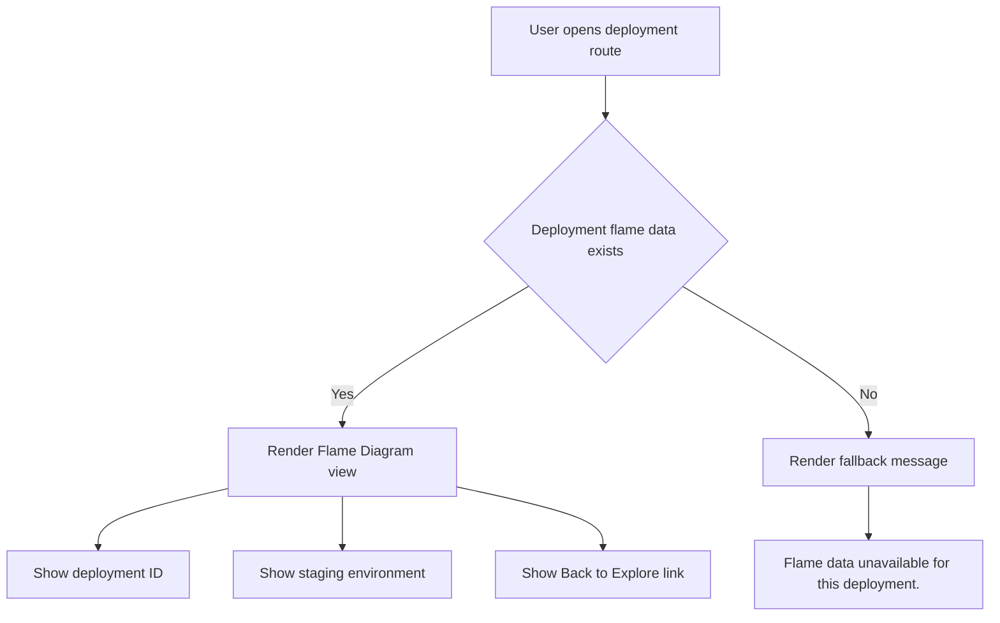
```mermaid
flowchart TD
    U[User opens deployment route] --> R{Deployment flame data exists}
    R -- Yes --> V[Render Flame Diagram view]
    V --> D1[Show deployment ID]
    V --> D2[Show staging environment]
    V --> D3[Show Back to Explore link]
    R -- No --> F[Render fallback message]
    F --> M[Flame data unavailable for this deployment.]
```
Test coverage
| Layer | Coverage | Tests | Notes |
|---|---|---|---|
| Backend Unit | — | — | No backend unit source listed for deployment flame payload generation. |
| Frontend Unit | — | — | No deployment flame component unit source listed. |
| Frontend E2E | ✅ | `tests/deployments.spec.ts` | Covers happy path and fallback rendering states. |
| Live E2E | — | — | No live e2e source listed for deployment flame route. |
### 3.7 Marketing & Pricing Pages
Purpose
- Covers marketing landing route and pricing route with dynamic billing-backed prices.
- Documents core content blocks and CTA navigation behavior.
Primary test file
- `tests/marketing-pricing.spec.ts`
Routes
- `/`
- `/pricing`
Marketing page expectations
- Hero text includes `Where is your engineering effort`.
- Feature areas include Signals, Investment, Flow, DORA, Quadrant, Developer Health.
- Persona sections include IC, EM, PM, Leadership.
- Navigation includes pricing link.
Pricing page expectations
- Heading `Simple, transparent pricing`.
- Three tiers:
  - Community = Free
  - Team = $49
  - Enterprise = $129
- Dynamic prices sourced from billing API.
- Comparison table present.
- CTA buttons navigate to `/auth/signup`.
- `Talk to sales` link present.
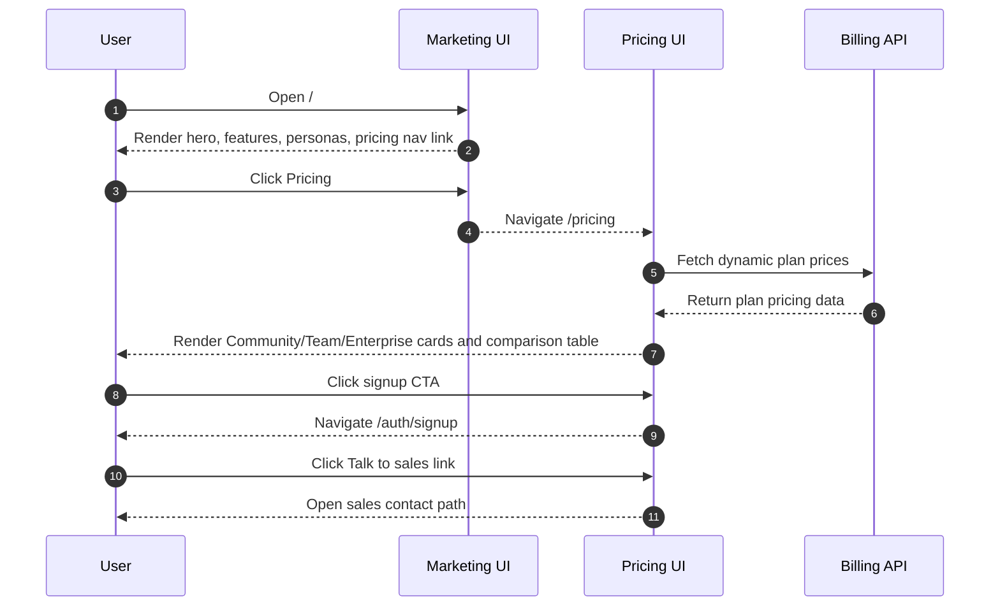
```mermaid
sequenceDiagram
    autonumber
    participant U as User
    participant M as Marketing UI
    participant P as Pricing UI
    participant B as Billing API
    U->>M: Open /
    M-->>U: Render hero, features, personas, pricing nav link
    U->>M: Click Pricing
    M-->>P: Navigate /pricing
    P->>B: Fetch dynamic plan prices
    B-->>P: Return plan pricing data
    P-->>U: Render Community/Team/Enterprise cards and comparison table
    U->>P: Click signup CTA
    P-->>U: Navigate /auth/signup
    U->>P: Click Talk to sales link
    P-->>U: Open sales contact path
```
Test coverage
| Layer | Coverage | Tests | Notes |
|---|---|---|---|
| Backend Unit | — | — | No backend pricing-page data test listed in provided source set. |
| Frontend Unit | — | — | No marketing/pricing unit test source listed. |
| Frontend E2E | ✅ | `tests/marketing-pricing.spec.ts` | Verifies key content blocks and pricing behavior in browser flow. |
| Live E2E | — | — | No live e2e source listed for marketing/pricing pages. |
## 4. Platform Admin Journeys
### 4.1 Impersonation Lifecycle
Purpose
- Covers superadmin impersonation start/status/stop API lifecycle.
- Documents middleware-based context swap behavior without token issuance.
Primary test files
- `tests/live/impersonation.spec.ts`
- `tests/api/admin/test_impersonation_endpoints.py`
API endpoints
- `POST /api/v1/admin/impersonate` with `{target_user_id}`
- `GET /api/v1/admin/impersonate/status`
- `POST /api/v1/admin/impersonate/stop`
Response contracts
- Start: `{status: "active", target_user: {id, email, org_id, role}, expires_at}`
- Status: `{is_impersonating: bool, target_user_id, expires_at}`
- Stop: `{status: "stopped"}`
Error contracts
- `403` for superuser to superuser impersonation attempt.
- `400` for self-impersonation attempt.
- `401/403` for unauthenticated or unauthorized access.
Security model
- No new token issued.
- Middleware performs context swap.
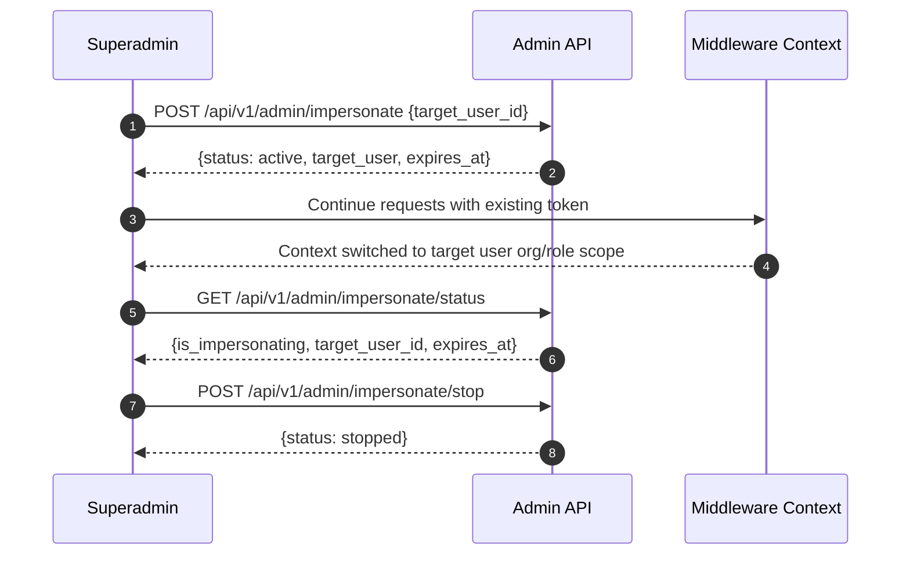
```mermaid
sequenceDiagram
    autonumber
    participant SA as Superadmin
    participant API as Admin API
    participant MW as Middleware Context
    SA->>API: POST /api/v1/admin/impersonate {target_user_id}
    API-->>SA: {status: active, target_user, expires_at}
    SA->>MW: Continue requests with existing token
    MW-->>SA: Context switched to target user org/role scope
    SA->>API: GET /api/v1/admin/impersonate/status
    API-->>SA: {is_impersonating, target_user_id, expires_at}
    SA->>API: POST /api/v1/admin/impersonate/stop
    API-->>SA: {status: stopped}
```
Test coverage
| Layer | Coverage | Tests | Notes |
|---|---|---|---|
| Backend Unit | ✅ | `tests/api/admin/test_impersonation_endpoints.py` | Unit coverage for endpoint contract and restriction rules. |
| Frontend Unit | ✅ | `src/lib/__tests__/access-matrix.test.ts` | Frontend access matrix includes impersonation-aware feature resolution context. |
| Frontend E2E | — | — | No non-live frontend e2e source listed for impersonation UI flow. |
| Live E2E | ✅ | `tests/live/impersonation.spec.ts` | Validates lifecycle behavior in live environment. |
### 4.2 Billing Plan Management
Purpose
- Covers superadmin billing plan CRUD and Stripe product sync process.
- Validates pricing page consumption of billing API plan values.
Primary test files
- `tests/billing-plans.spec.ts`
- `tests/test_billing_plans.py`
Route
- `/superadmin/billing/plans`
Core lifecycle actions
- Create plan with fields: name, key, tier, display order, description, pricing intervals JSON.
- Confirm card appears.
- Edit plan and save changes.
- Trigger `Sync Stripe`.
- Confirm `prod_` identifier appears.
- Archive plan.
- Confirm `Status: inactive`.
Downstream dependency
- `/pricing` reflects billing API plan values dynamically.
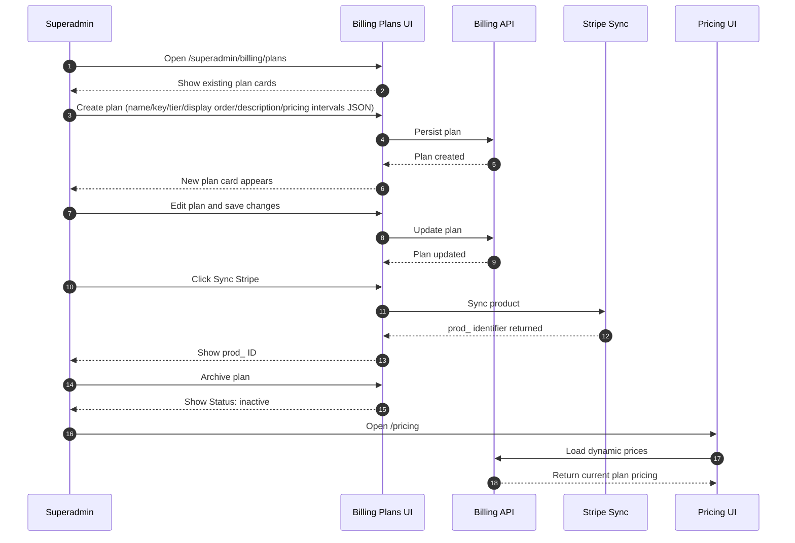
```mermaid
sequenceDiagram
    autonumber
    participant SA as Superadmin
    participant UI as Billing Plans UI
    participant API as Billing API
    participant ST as Stripe Sync
    participant PR as Pricing UI
    SA->>UI: Open /superadmin/billing/plans
    UI-->>SA: Show existing plan cards
    SA->>UI: Create plan (name/key/tier/display order/description/pricing intervals JSON)
    UI->>API: Persist plan
    API-->>UI: Plan created
    UI-->>SA: New plan card appears
    SA->>UI: Edit plan and save changes
    UI->>API: Update plan
    API-->>UI: Plan updated
    SA->>UI: Click Sync Stripe
    UI->>ST: Sync product
    ST-->>UI: prod_ identifier returned
    UI-->>SA: Show prod_ ID
    SA->>UI: Archive plan
    UI-->>SA: Show Status: inactive
    SA->>PR: Open /pricing
    PR->>API: Load dynamic prices
    API-->>PR: Return current plan pricing
```
Test coverage
| Layer | Coverage | Tests | Notes |
|---|---|---|---|
| Backend Unit | ✅ | `tests/test_billing_plans.py` | Covers plan model and API behavior including sync-related logic. |
| Frontend Unit | — | — | No dedicated billing plans unit test file listed. |
| Frontend E2E | ✅ | `tests/billing-plans.spec.ts` | Covers superadmin plan CRUD/sync/archive journey. |
| Live E2E | — | — | No live e2e source listed for billing plans route. |
### 4.3 Subscription Management
Purpose
- Covers billing section subscription visibility and plan change modal behavior.
- Documents webhook-driven subscription state updates.
Primary test files
- `tests/billing-subscriptions.spec.ts`
- `tests/test_subscriptions.py`
Route
- `/admin/settings` (Billing section)
Expected billing section elements
- `Current Plan`
- `Subscription History`
- `Change Plan` button
Change Plan modal behavior
- Uses plan picker cards.
- Does not use raw price ID input.
- `Confirm Change` remains disabled until a plan is selected.
Backend event model
- Webhook-driven state changes via:
  - `customer.subscription.created`
  - `customer.subscription.updated`
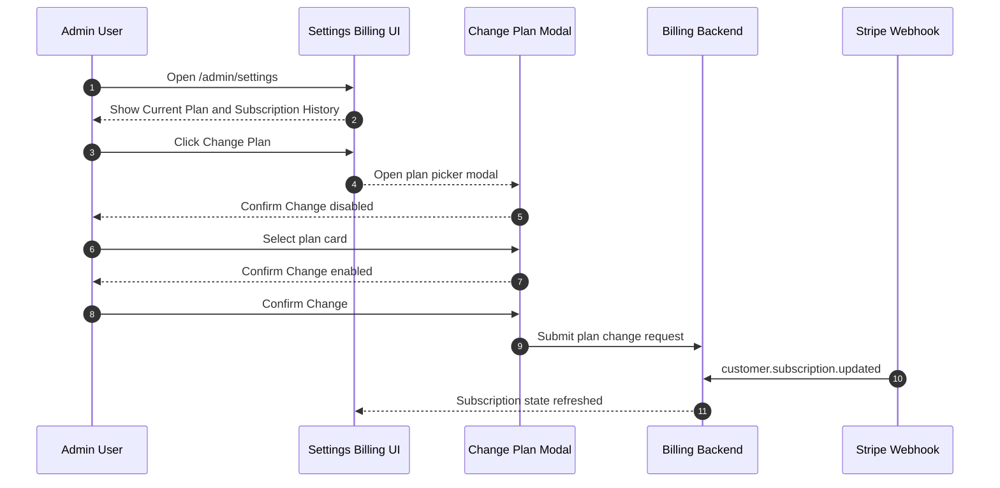
```mermaid
sequenceDiagram
    autonumber
    participant U as Admin User
    participant S as Settings Billing UI
    participant M as Change Plan Modal
    participant API as Billing Backend
    participant WH as Stripe Webhook
    U->>S: Open /admin/settings
    S-->>U: Show Current Plan and Subscription History
    U->>S: Click Change Plan
    S-->>M: Open plan picker modal
    M-->>U: Confirm Change disabled
    U->>M: Select plan card
    M-->>U: Confirm Change enabled
    U->>M: Confirm Change
    M->>API: Submit plan change request
    WH->>API: customer.subscription.updated
    API-->>S: Subscription state refreshed
```
Test coverage
| Layer | Coverage | Tests | Notes |
|---|---|---|---|
| Backend Unit | ✅ | `tests/test_subscriptions.py` | Covers subscription state transitions and webhook effects. |
| Frontend Unit | — | — | No dedicated unit test file listed for subscription modal path. |
| Frontend E2E | ✅ | `tests/billing-subscriptions.spec.ts` | Covers billing section and change-plan modal interactions. |
| Live E2E | — | — | No live e2e source listed for subscription management. |
### 4.4 Invoice Management
Purpose
- Covers invoice list, details modal, and void flow lifecycle.
- Confirms status transition from active to void after confirmation.
Primary test file
- `tests/billing-invoices.spec.ts`
Route
- `/superadmin/billing/invoices`
Expected list details
- Invoice ID visible.
- Amount visible (example `$120.00`).
View flow
- Click `View`.
- `Invoice Details` modal opens.
- Displays `Team plan`.
- Close returns to list context.
Void flow
- Click `Void`.
- `Void Invoice` modal opens.
- Confirm via `Confirm Void`.
- `Invoice voided` toast appears.
- Row status updates to `void`.
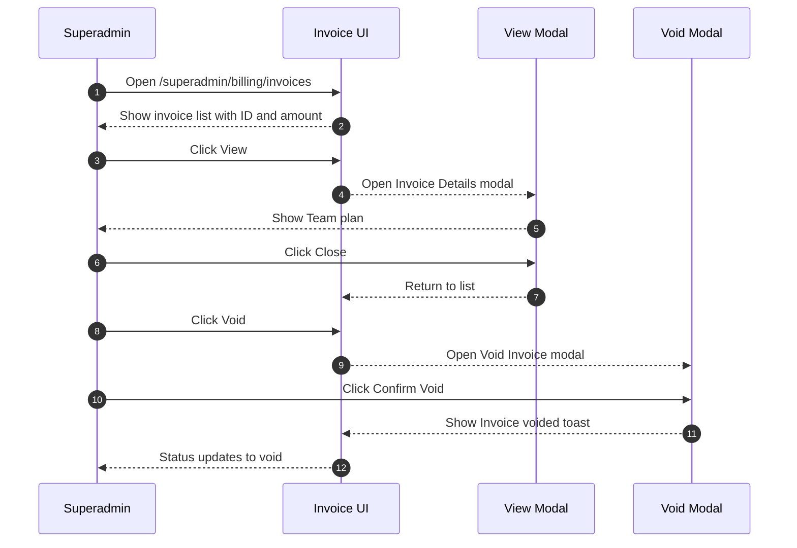
```mermaid
sequenceDiagram
    autonumber
    participant SA as Superadmin
    participant I as Invoice UI
    participant VM as View Modal
    participant XM as Void Modal
    SA->>I: Open /superadmin/billing/invoices
    I-->>SA: Show invoice list with ID and amount
    SA->>I: Click View
    I-->>VM: Open Invoice Details modal
    VM-->>SA: Show Team plan
    SA->>VM: Click Close
    VM-->>I: Return to list
    SA->>I: Click Void
    I-->>XM: Open Void Invoice modal
    SA->>XM: Click Confirm Void
    XM-->>I: Show Invoice voided toast
    I-->>SA: Status updates to void
```
Test coverage
| Layer | Coverage | Tests | Notes |
|---|---|---|---|
| Backend Unit | — | — | No backend unit invoice CRUD test listed in provided source set. |
| Frontend Unit | — | — | No frontend invoice unit test file listed in provided source set. |
| Frontend E2E | ✅ | `tests/billing-invoices.spec.ts` | Covers listing, details modal, and void lifecycle. |
| Live E2E | — | — | No live e2e source listed for invoice management route. |
### 4.5 Refund Validation
Purpose
- Covers refund initiation validation and backend refund constraints.
- Confirms partial refund validation against refundable balance.
Primary test files
- `tests/billing-refunds.spec.ts`
- `tests/test_refunds.py`
Route
- `/billing-refunds-test`
UI flow
- Click `Issue Refund`.
- Check `Partial refund`.
- Enter amount.
- Click `Continue`.
- Validation message appears: `Amount cannot exceed the refundable balance.`
Backend constraints
- Invoice must be paid.
- Refund amount must be `<= refundable balance`.
- Webhook `charge.refund.updated` drives status transitions.
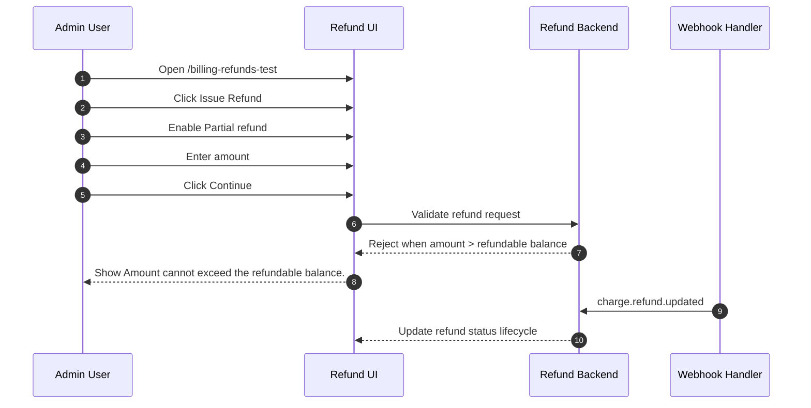
```mermaid
sequenceDiagram
    autonumber
    participant U as Admin User
    participant R as Refund UI
    participant API as Refund Backend
    participant WH as Webhook Handler
    U->>R: Open /billing-refunds-test
    U->>R: Click Issue Refund
    U->>R: Enable Partial refund
    U->>R: Enter amount
    U->>R: Click Continue
    R->>API: Validate refund request
    API-->>R: Reject when amount > refundable balance
    R-->>U: Show Amount cannot exceed the refundable balance.
    WH->>API: charge.refund.updated
    API-->>R: Update refund status lifecycle
```
Test coverage
| Layer | Coverage | Tests | Notes |
|---|---|---|---|
| Backend Unit | ✅ | `tests/test_refunds.py` | Covers paid-invoice constraint and refundable amount bounds. |
| Frontend Unit | — | — | No frontend refund unit test file listed in provided sources. |
| Frontend E2E | ✅ | `tests/billing-refunds.spec.ts` | Covers UI validation path for partial refund flow. |
| Live E2E | — | — | No live e2e source listed for refund validation route. |
### 4.6 Billing Audit
Purpose
- Covers billing audit console route and unauthenticated fallback behavior.
- Documents reconciliation control surface on superadmin page.
Primary test file
- `tests/billing-audit.spec.ts`
Route
- `/superadmin/billing/audit`
Expected controls
- `Billing Audit` heading.
- `Run Reconciliation` button.
- `Apply` button.
Auth fallback behavior
- Unauthenticated requests redirect to signin route.
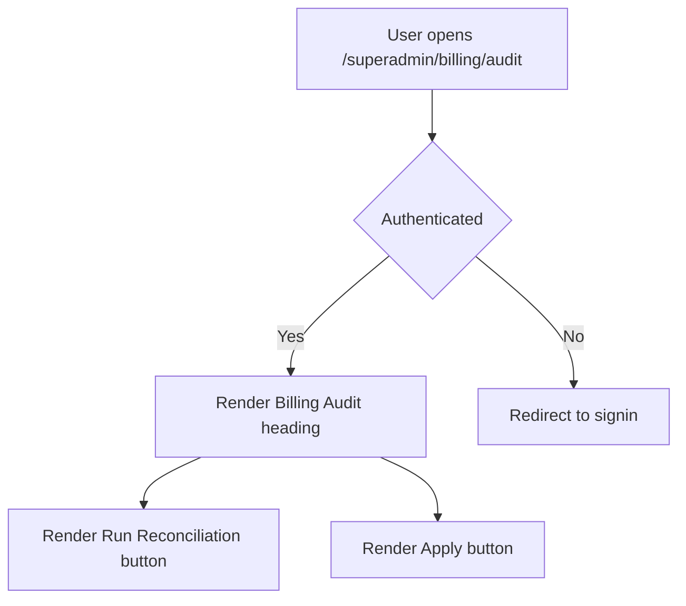
```mermaid
flowchart TD
    U[User opens /superadmin/billing/audit] --> A{Authenticated}
    A -- Yes --> B[Render Billing Audit heading]
    B --> C[Render Run Reconciliation button]
    B --> D[Render Apply button]
    A -- No --> R[Redirect to signin]
```
Test coverage
| Layer | Coverage | Tests | Notes |
|---|---|---|---|
| Backend Unit | — | — | No backend unit source listed for billing audit endpoints or logic. |
| Frontend Unit | — | — | No frontend unit source listed for billing audit page. |
| Frontend E2E | ✅ | `tests/billing-audit.spec.ts` | Covers route content and unauthenticated fallback behavior. |
| Live E2E | — | — | No live e2e source listed for billing audit journey. |
### 4.7 IP Allowlisting
Purpose
- Covers admin IP allowlist CRUD and allow check endpoint behavior.
- Documents validation and default-open behavior for empty allowlist.
Primary test files
- `tests/api/admin/test_ip_allowlist.py`
- `src/lib/admin/__tests__/server.test.ts`
API scope
- CRUD operations on `/api/v1/admin/ip-allowlist`.
- Check endpoint confirms allow decision.
Validation rules
- CIDR notation is required.
- Empty allowlist means all IPs are allowed.
- Check response includes `allowed: true/false`.
Frontend integration source
- Server action coverage in `src/lib/admin/__tests__/server.test.ts`.
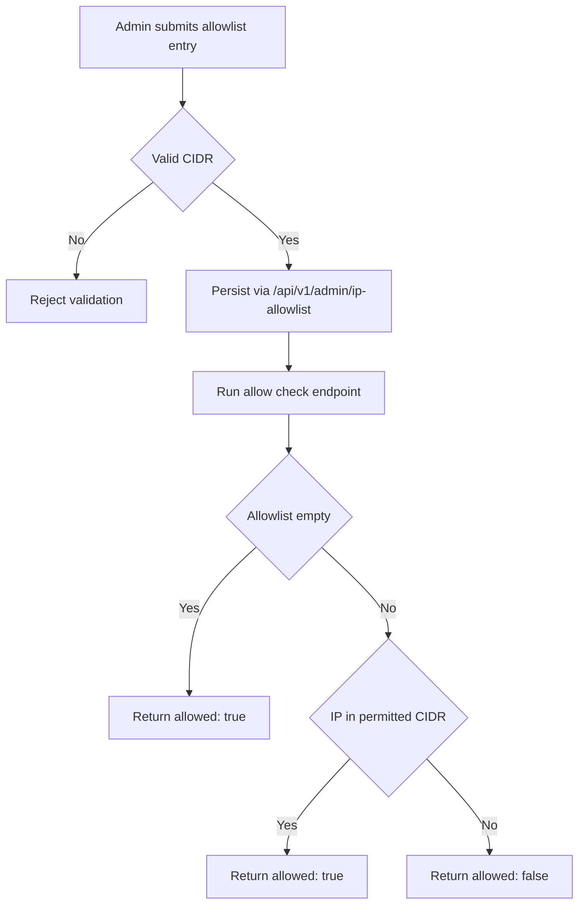
```mermaid
flowchart TD
    A[Admin submits allowlist entry] --> V{Valid CIDR}
    V -- No --> E[Reject validation]
    V -- Yes --> C[Persist via /api/v1/admin/ip-allowlist]
    C --> Q[Run allow check endpoint]
    Q --> L{Allowlist empty}
    L -- Yes --> T1[Return allowed: true]
    L -- No --> M{IP in permitted CIDR}
    M -- Yes --> T2[Return allowed: true]
    M -- No --> T3[Return allowed: false]
```
Test coverage
| Layer | Coverage | Tests | Notes |
|---|---|---|---|
| Backend Unit | ✅ | `tests/api/admin/test_ip_allowlist.py` | Covers CRUD, CIDR validation, and check endpoint semantics. |
| Frontend Unit | ✅ | `src/lib/admin/__tests__/server.test.ts` | Covers server action integration points for admin controls. |
| Frontend E2E | — | — | No frontend e2e source listed for allowlist UI workflow. |
| Live E2E | — | — | No live e2e source listed for IP allowlisting. |
### 4.8 Retention Policies
Purpose
- Covers retention policy CRUD and execution endpoint behavior.
- Documents duplicate resource-type rejection rule.
Primary test files
- `tests/api/admin/test_retention.py`
- `src/lib/admin/__tests__/server.test.ts`
API scope
- CRUD operations on `/api/v1/admin/retention-policies`.
- Payload shape includes `{resource_type, retention_days}`.
- Execution endpoint triggers retention action.
Validation rules
- Duplicate `resource_type` returns `400`.
Frontend integration source
- Server action coverage in `src/lib/admin/__tests__/server.test.ts`.
```mermaid
flowchart TD
    A[Admin creates retention policy] --> P[POST /api/v1/admin/retention-policies]
    P --> D{resource_type duplicate}
    D -- Yes --> E[Return 400]
    D -- No --> S[Persist policy]
    S --> U[Update or list policies]
    U --> X[Run execution endpoint]
    X --> R[Retention run completes]
```
Test coverage
| Layer | Coverage | Tests | Notes |
|---|---|---|---|
| Backend Unit | ✅ | `tests/api/admin/test_retention.py` | Covers CRUD behavior, duplicate constraints, and execution path. |
| Frontend Unit | ✅ | `src/lib/admin/__tests__/server.test.ts` | Covers server action integration for retention policy operations. |
| Frontend E2E | — | — | No frontend e2e source listed for retention policy UI flow. |
| Live E2E | — | — | No live e2e source listed for retention policy management. |
### 4.9 Platform Stats
Purpose
- Covers platform-level aggregate stats endpoint for admin observability.
- Documents expected count categories and health metrics returned.
Primary test file
- `tests/test_platform_stats.py`
API endpoint
- `GET /api/v1/admin/platform/stats`
Returned domains
- Organization counts.
- User counts: total, active, superuser.
- Sync configuration counts.
- Tier distribution.
- Sync health counts: success and failed.
```mermaid
sequenceDiagram
    autonumber
    participant SA as Superadmin
    participant API as Platform Stats API
    participant DB as Metrics/Data Stores
    SA->>API: GET /api/v1/admin/platform/stats
    API->>DB: Query org/user/sync/tier/health aggregates
    DB-->>API: Aggregate counts
    API-->>SA: Return stats payload
```
Test coverage
| Layer | Coverage | Tests | Notes |
|---|---|---|---|
| Backend Unit | ✅ | `tests/test_platform_stats.py` | Covers endpoint payload structure and aggregate values. |
| Frontend Unit | — | — | No frontend stats consumer test listed. |
| Frontend E2E | — | — | No frontend e2e source listed for platform stats display. |
| Live E2E | — | — | No live e2e source listed for this endpoint flow. |
### 4.10 Tier Feature Gating
Purpose
- Covers tier-based access control at backend decorator and frontend gating layers.
- Documents impersonation interaction with target organization tier visibility.
Primary test files
- `tests/test_community_features.py`
- `src/lib/__tests__/access-matrix.test.ts`
Tier model
- `community`
- `team`
- `enterprise`
Backend enforcement
- `@require_feature` decorator checks `Organization.tier`.
- Community tier receives `403` on enterprise-only features.
Frontend enforcement
- `UpgradeGate` component controls gated content.
- `AdminSidebar` filters items by `featureKey`.
Impersonation behavior
- Superuser sees feature availability resolved using target organization tier.
```mermaid
flowchart TD
    U[User requests feature] --> B[@require_feature checks Organization.tier]
    B --> T{Tier supports feature}
    T -- Yes --> OK[Allow backend action]
    T -- No --> F403[Return 403]
    OK --> FE[Frontend route loads]
    FE --> G[UpgradeGate evaluates feature]
    G --> S[AdminSidebar filters by featureKey]
    S --> V[Render only allowed items]
    I[If impersonating] --> TI[Resolve tier from target org]
    TI --> G
```
Test coverage
| Layer | Coverage | Tests | Notes |
|---|---|---|---|
| Backend Unit | ✅ | `tests/test_community_features.py` | Covers backend decorator behavior across tiers. |
| Frontend Unit | ✅ | `src/lib/__tests__/access-matrix.test.ts` | Covers frontend access matrix and gating semantics. |
| Frontend E2E | — | — | No frontend e2e source listed for tier gating navigation behavior. |
| Live E2E | — | — | No live e2e source listed for tier gating. |
## 5. Test Coverage Summary
### 5.1 Master Coverage Matrix
| Journey | Backend Unit | Frontend Unit | Frontend E2E | Live E2E |
|---|---|---|---|---|
| Full Account Setup | — | — | ✅ | ✅ |
| Integration Setup | ✅ (`test_admin_credentials.py`) | ✅ (`IntegrationForm.test.tsx`) | ✅ (`admin-integrations.spec.ts`, account-creation-journey step 4) | ✅ (`journey.spec.ts`) |
| Sync Configuration | ✅ (`test_sync_configs.py`) | ✅ (`SyncConfigForm.test.tsx`) | ✅ (`admin-sync.spec.ts`, account-creation-journey step 5) | ✅ (`journey.spec.ts`) |
| Team Management | ✅ (`test_teams.py`) | ✅ (`TeamForm.test.tsx`) | ✅ (`admin-teams.spec.ts`, account-creation-journey step 6) | — |
| Identity Mapping | ✅ (`test_identities.py`) | ✅ (`IdentityForm.test.tsx`) | ✅ (`admin-identities.spec.ts`, account-creation-journey step 7) | — |
| Organization Settings | — | — | ✅ (`admin-settings.spec.ts`) | — |
| Dashboard & Drill-down | — | — | ✅ (`home-flow.spec.ts`) | — |
| Work Navigation | — | — | ✅ (`work-navigation.spec.ts`) | — |
| Filter Propagation | — | — | ✅ (`filter-propagation.spec.ts`) | — |
| People Search | — | — | ✅ (`people.spec.ts`) | — |
| Chart Rendering | — | — | ✅ (`sankey/quadrant/heatmap/flame.spec.ts`) | — |
| Deployment Flame | — | — | ✅ (`deployments.spec.ts`) | — |
| Marketing/Pricing | — | — | ✅ (`marketing-pricing.spec.ts`) | — |
| Impersonation | ✅ (`test_impersonation_endpoints.py`) | ✅ (`access-matrix.test.ts`) | — | ✅ (`impersonation.spec.ts`) |
| Billing Plans | ✅ (`test_billing_plans.py`) | — | ✅ (`billing-plans.spec.ts`) | — |
| Subscriptions | ✅ (`test_subscriptions.py`) | — | ✅ (`billing-subscriptions.spec.ts`) | — |
| Invoices | — | — | ✅ (`billing-invoices.spec.ts`) | — |
| Refunds | ✅ (`test_refunds.py`) | — | ✅ (`billing-refunds.spec.ts`) | — |
| Billing Audit | — | — | ✅ (`billing-audit.spec.ts`) | — |
| IP Allowlisting | ✅ (`test_ip_allowlist.py`) | ✅ (`server.test.ts`) | — | — |
| Retention Policies | ✅ (`test_retention.py`) | ✅ (`server.test.ts`) | — | — |
| Platform Stats | ✅ (`test_platform_stats.py`) | — | — | — |
| Tier Feature Gating | ✅ (`test_community_features.py`) | ✅ (`access-matrix.test.ts`) | — | — |
### 5.2 Coverage Gaps
| Journey | Missing Coverage | Priority |
|---------|-----------------|----------|
| Organization Settings | No backend unit tests for settings CRUD | Medium |
| Dashboard & Drill-down | No backend or unit tests | Low |
| Work Navigation | No backend or unit tests | Low |
| Filter Propagation | No backend or unit tests (URL-only logic) | Low |
| People Search | No backend unit tests for search endpoint | Medium |
| Chart Rendering | No unit tests for chart components | Medium |
| Deployment Flame | No backend unit tests for deployment data | Medium |
| Marketing/Pricing | No backend tests for pricing page data | Low |
| Invoices | No backend unit tests for invoice CRUD | Medium |
| Billing Audit | No backend or unit tests | Medium |
| IP Allowlisting | No frontend E2E tests | Low |
| Retention Policies | No frontend E2E tests | Low |
| Platform Stats | No frontend tests at all | Medium |
| Tier Feature Gating | No frontend E2E tests | Low |
