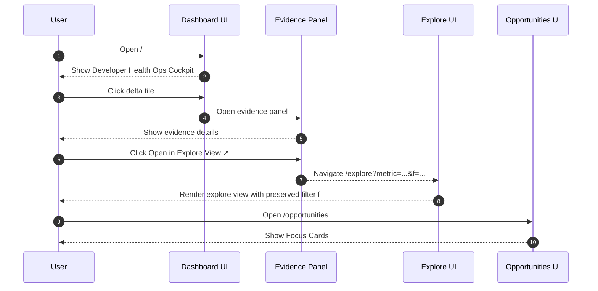
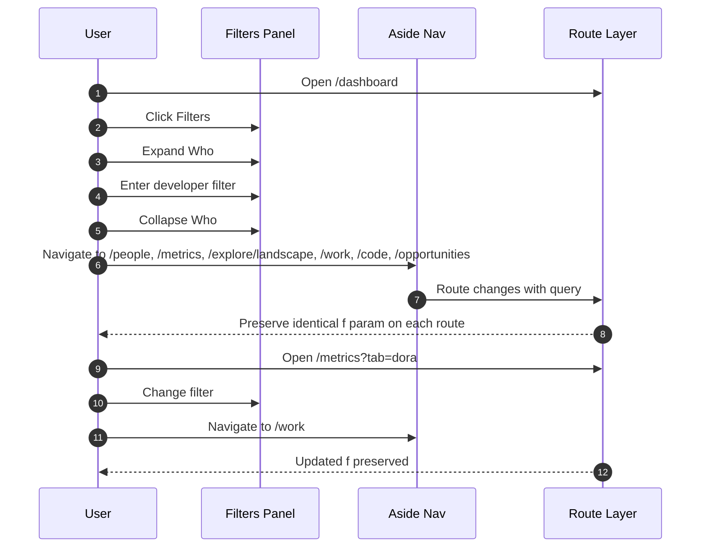
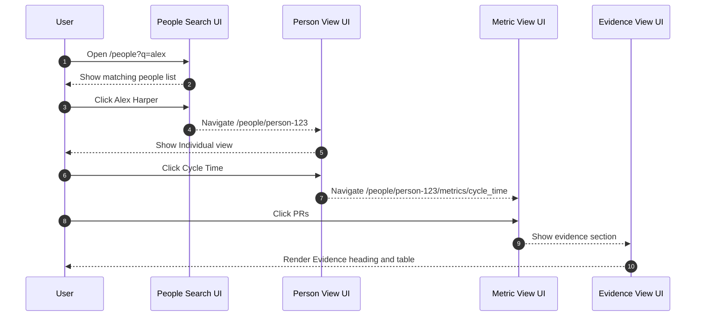
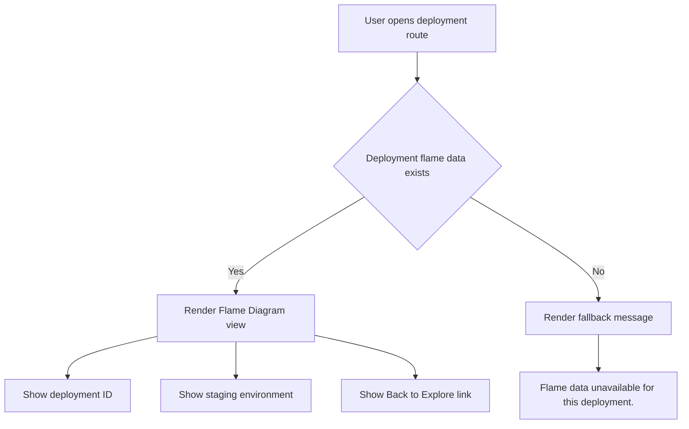
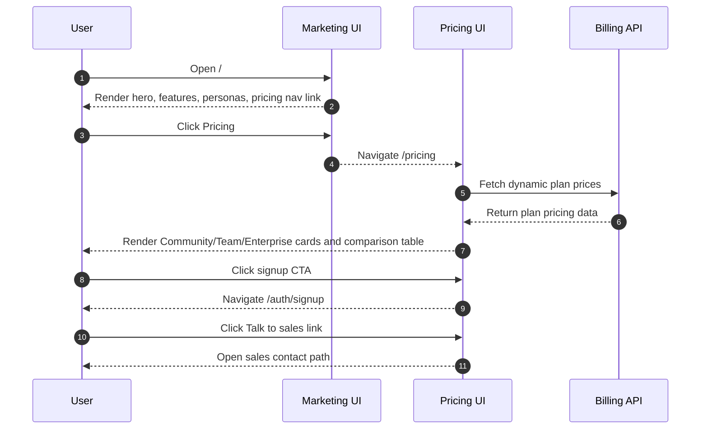

# Account User Journeys

## Dashboard Landing & Drill-down

Purpose

- Covers dashboard entry, tile drill-down, evidence panel, and explore deep-linking.
- Verifies filter parameter continuity into explore route.

Primary test file

- `tests/home-flow.spec.ts`

Routes

- `/` with heading `Developer Health Ops Cockpit`
- `/explore?metric=...&f=...`
- `/opportunities` with heading `Focus Cards`

Core interaction chain

- Open dashboard.
- Click delta tile.
- Evidence panel opens.
- Click `Open in Explore View ↗`.
- Navigate to explore route with `metric` and preserved `f`.



Test coverage

| Layer         | Coverage | Tests                     | Notes                                                        |
| ------------- | -------- | ------------------------- | ------------------------------------------------------------ |
| Backend Unit  | —        | —                         | No backend unit source listed for dashboard drill-down flow. |
| Frontend Unit | —        | —                         | No component unit source listed for this journey.            |
| Frontend E2E  | ✅       | `tests/home-flow.spec.ts` | Route and deep-link continuity are covered end-to-end.       |
| Live E2E      | —        | —                         | No live e2e source listed for this journey.                  |

## Work Tabbed Navigation

Purpose

- Covers tab-specific rendering, URL tab routing, and investigation deep links.
- Verifies persistence of filter state across tab switches.

Primary test file

- `tests/work-navigation.spec.ts`

Route contract

- `/work?tab=[landscape|heatmap|flow|investment|flame]`

Tab expectations

- Default tab `landscape` renders `Investment Mix`.
- `heatmap` renders `Review wait density`.
- `flow` renders `Investment Mix` and `flow-chart-container`.
- `investment` renders `Work Unit Investment` and `Treemap`.
- `flame` renders `Elapsed Time Breakdown` and `chart-flame`.

Investigation routes

- Quadrant entity click then `View Flow` to `/work?tab=flow&context_entity_id=...`.
- Flow view shows `Filtering flow by` text.
- Flame deep-link `/work?tab=flame&mode=throughput&context_node=Backend`.
- Deep-link shows `Context: Analyzing decomposition starting from node`.

```mermaid
flowchart TD
    U[User opens /work] --> D{tab param present}
    D -- No --> L[Load default landscape tab]
    D -- Yes --> T[Load selected tab]
    L --> H1[Show Investment Mix]
    T --> K{Tab value}
    K -- heatmap --> H2[Show Review wait density]
    K -- flow --> F1[Show Investment Mix and flow-chart-container]
    K -- investment --> I1[Show Work Unit Investment and Treemap]
    K -- flame --> FL1[Show Elapsed Time Breakdown and chart-flame]
    F1 --> Q[Quadrant panel entity click]
    Q --> VF[View Flow link]
    VF --> F2[/work?tab=flow&context_entity_id=...]
    F2 --> FX[Show Filtering flow by]
    FL1 --> DL[/work?tab=flame&mode=throughput&context_node=Backend]
    DL --> CX[Show Context: Analyzing decomposition starting from node]
```

Test coverage

| Layer         | Coverage | Tests                           | Notes                                                           |
| ------------- | -------- | ------------------------------- | --------------------------------------------------------------- |
| Backend Unit  | —        | —                               | No backend unit source listed for client-side tab routing flow. |
| Frontend Unit | —        | —                               | No tab component unit source listed in provided data.           |
| Frontend E2E  | ✅       | `tests/work-navigation.spec.ts` | Covers all tab modes and context deep-links.                    |
| Live E2E      | —        | —                               | No live e2e source listed for tabbed work navigation.           |

## Filter Propagation

Purpose

- Covers cross-route filter continuity through shared navigation.
- Validates that encoded filter query parameter is identical after navigation.

Primary test file

- `tests/filter-propagation.spec.ts`

Primary routes in scope

- `/dashboard`
- `/people`
- `/metrics`
- `/explore/landscape`
- `/work`
- `/code`
- `/opportunities`

Additional route in scope

- `/metrics?tab=dora`

Flow behavior

- Open `Filters` panel.
- Expand `Who`.
- Fill developer filter.
- Collapse filter group.
- Navigate via `aside nav`.
- Confirm `f` query parameter is identical on destination routes.



Test coverage

| Layer         | Coverage | Tests                              | Notes                                                               |
| ------------- | -------- | ---------------------------------- | ------------------------------------------------------------------- |
| Backend Unit  | —        | —                                  | No backend unit source listed for URL-only propagation behavior.    |
| Frontend Unit | —        | —                                  | No dedicated unit coverage listed for global filter shell behavior. |
| Frontend E2E  | ✅       | `tests/filter-propagation.spec.ts` | Source of truth for end-to-end URL preservation behavior.           |
| Live E2E      | —        | —                                  | No live e2e source listed for filter propagation journey.           |

## People Search & Individual Views

Purpose

- Covers people search, person detail route, metric drill-in, and evidence listing.
- Enforces language guardrail against comparative performance framing.

Primary test file

- `tests/people.spec.ts`

Route sequence

- `/people?q=alex`
- `/people/person-123`
- `/people/person-123/metrics/cycle_time`

Interaction chain

- Search by query parameter.
- Open person profile.
- Verify `Individual view` context.
- Open `Cycle Time` metric detail.
- Open `PRs` evidence section with heading and table.

Guardrail terms excluded

- `rank`
- `percentile`
- `top performer`
- `bottom performer`
- `score`



Test coverage

| Layer         | Coverage | Tests                  | Notes                                                              |
| ------------- | -------- | ---------------------- | ------------------------------------------------------------------ |
| Backend Unit  | —        | —                      | No backend unit source listed for people search endpoint behavior. |
| Frontend Unit | —        | —                      | No people-page unit test file listed in provided data.             |
| Frontend E2E  | ✅       | `tests/people.spec.ts` | Covers search, drill-down, and guardrail assertions.               |
| Live E2E      | —        | —                      | No live e2e source listed for people journey.                      |

## Chart Interactions

Purpose

- Covers rendering readiness and interaction surfaces for chart families.
- Includes sankey, quadrant, heatmap, and flame chart behavior on demo route.

Primary test files

- `tests/sankey.spec.ts`
- `tests/quadrant.spec.ts`
- `tests/heatmap.spec.ts`
- `tests/flame.spec.ts`

Shared route

- `/demo`

Rendering readiness signals

- Chart canvas exists.
- `data-chart-ready="true"` is present.

Chart-specific behaviors

- Sankey investigation path starts from quadrant panel.
- `Core` button appears in investigation context.
- `View Flow` deep-links into `/work?tab=flow`.
- Flame mode selector supports:
    - `Elapsed Time Breakdown`
    - `Throughput Breakdown`
    - `Code Hotspots`
- Flame mode changes update `mode=` query parameter.

```mermaid
flowchart TD
    U[User opens /demo] --> R[Chart shell renders]
    R --> C{Canvas and data-chart-ready=true}
    C -- Yes --> Q[Quadrant interactions enabled]
    Q --> CORE[Click Core button]
    CORE --> VF[Click View Flow]
    VF --> W[/work?tab=flow]
    C -- Yes --> FL[Flame interactions enabled]
    FL --> M{Select mode}
    M -- Elapsed Time Breakdown --> U1[URL mode=elapsed]
    M -- Throughput Breakdown --> U2[URL mode=throughput]
    M -- Code Hotspots --> U3[URL mode=hotspots]
```

Test coverage

| Layer         | Coverage | Tests                                                                                            | Notes                                                                  |
| ------------- | -------- | ------------------------------------------------------------------------------------------------ | ---------------------------------------------------------------------- |
| Backend Unit  | —        | —                                                                                                | No backend unit source listed for client chart rendering interactions. |
| Frontend Unit | —        | —                                                                                                | No chart component unit tests listed in provided data set.             |
| Frontend E2E  | ✅       | `tests/sankey.spec.ts`, `tests/quadrant.spec.ts`, `tests/heatmap.spec.ts`, `tests/flame.spec.ts` | Multi-spec e2e coverage for rendering and interaction flows.           |
| Live E2E      | —        | —                                                                                                | No live e2e chart interaction source listed.                           |

## Deployment Flame View

Purpose

- Covers deployment-specific flame visualization route and fallback state.
- Confirms metadata and back-navigation rendering.

Primary test file

- `tests/deployments.spec.ts`

Route in scope

- `/deployments/deploy-123`

Expected elements

- `Flame Diagram` heading.
- Deployment ID.
- `staging` environment label.
- `Back to Explore` link.

Fallback route

- `/deployments/missing-flame`
- Displays `Flame data unavailable for this deployment.`



Test coverage

| Layer         | Coverage | Tests                       | Notes                                                                  |
| ------------- | -------- | --------------------------- | ---------------------------------------------------------------------- |
| Backend Unit  | —        | —                           | No backend unit source listed for deployment flame payload generation. |
| Frontend Unit | —        | —                           | No deployment flame component unit source listed.                      |
| Frontend E2E  | ✅       | `tests/deployments.spec.ts` | Covers happy path and fallback rendering states.                       |
| Live E2E      | —        | —                           | No live e2e source listed for deployment flame route.                  |

## Marketing & Pricing Pages

Purpose

- Covers marketing landing route and pricing route with dynamic billing-backed prices.
- Documents core content blocks and CTA navigation behavior.

Primary test file

- `tests/marketing-pricing.spec.ts`

Routes

- `/`
- `/pricing`

Marketing page expectations

- Hero text includes `Where is your engineering effort`.
- Feature areas include Signals, Investment, Flow, DORA, Quadrant, Developer Health.
- Persona sections include IC, EM, PM, Leadership.
- Navigation includes pricing link.

Pricing page expectations

- Heading `Simple, transparent pricing`.
- Three tiers:
    - Community = Free
    - Team = $49
    - Enterprise = $129
- Dynamic prices sourced from billing API.
- Comparison table present.
- CTA buttons navigate to `/auth/signup`.
- `Talk to sales` link present.



Test coverage

| Layer         | Coverage | Tests                             | Notes                                                             |
| ------------- | -------- | --------------------------------- | ----------------------------------------------------------------- |
| Backend Unit  | —        | —                                 | No backend pricing-page data test listed in provided source set.  |
| Frontend Unit | —        | —                                 | No marketing/pricing unit test source listed.                     |
| Frontend E2E  | ✅       | `tests/marketing-pricing.spec.ts` | Verifies key content blocks and pricing behavior in browser flow. |
| Live E2E      | —        | —                                 | No live e2e source listed for marketing/pricing pages.            |
