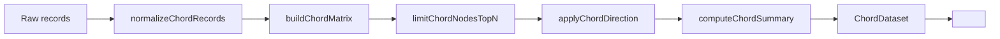

# ChordChart

Complements the existing Sankey visualization. Answers “who is trading load with whom?” for teams, repos, and work types.

## Purpose

The chord chart is a relationship-flow view for cross-entity exchange: it makes the strongest bilateral pairs, import/export imbalances, and overflow concentration legible at a glance. It is rendered with ECharts v6 native `series.type: 'chord'` and plugs into the existing `<Chart>` wrapper so it inherits the shared chart theme, tooltip behavior, resize handling, and readiness lifecycle already used across the chart library.

## API

### `ChordChart`

| Prop               | Type                                                                                                          | Required | Default            | Notes                                                  |
| ------------------ | ------------------------------------------------------------------------------------------------------------- | -------- | ------------------ | ------------------------------------------------------ |
| `dataset`          | `ChordDataset`                                                                                                | Yes      | —                  | Fully processed dataset from `buildChordDataset(...)`. |
| `unit`             | `string`                                                                                                      | No       | `"items"`          | Used in tooltip/value formatting.                      |
| `height`           | `number \| string`                                                                                            | No       | `420`              | Applied to the chart container.                        |
| `width`            | `number \| string`                                                                                            | No       | `"100%"`           | Applied to the chart container.                        |
| `className`        | `string`                                                                                                      | No       | —                  | Container class.                                       |
| `style`            | `CSSProperties`                                                                                               | No       | —                  | Merged with `height` / `width`.                        |
| `tooltipFormatter` | `(params: unknown, unit: string) => string`                                                                   | No       | Internal formatter | Override for custom HTML tooltip content.              |
| `onItemClick`      | `(item: { type: "node" \| "link"; name?: string; source?: string; target?: string; value?: number }) => void` | No       | —                  | Receives normalized node/link click payloads.          |

### `ChordChartControls`

| Prop             | Type                                 | Required | Default | Notes                                                                          |
| ---------------- | ------------------------------------ | -------- | ------- | ------------------------------------------------------------------------------ |
| `value`          | `ChordControlsValue`                 | Yes      | —       | Controlled state for direction, grouping, top-N, self-links, and Other bucket. |
| `onChange`       | `(next: ChordControlsValue) => void` | Yes      | —       | Emits the fully next control state.                                            |
| `otherAvailable` | `boolean`                            | No       | `true`  | Disables the Other-bucket checkbox when aggregation is not needed.             |
| `className`      | `string`                             | No       | `""`    | Wrapper class for layout integration.                                          |

Related exports for URL-synced control surfaces:

- `parseChordControlsFromSearchParams(...)`
- `serializeChordControlsToSearchParams(...)`
- `CHORD_CONTROLS_DEFAULTS`

### `ChordSummaryPanel`

| Prop             | Type                         | Required | Default | Notes                                                           |
| ---------------- | ---------------------------- | -------- | ------- | --------------------------------------------------------------- |
| `dataset`        | `ChordDataset \| null`       | Yes      | —       | `null` enables loading / empty states without fabricating data. |
| `unit`           | `string`                     | No       | —       | Included in row `aria-label`s and compact value display.        |
| `loading`        | `boolean`                    | No       | —       | Shows skeleton placeholders.                                    |
| `className`      | `string`                     | No       | `""`    | Wrapper class.                                                  |
| `onEntitySelect` | `(entityId: string) => void` | No       | —       | Fired when a summary row button is activated.                   |

## Data flow

Raw records flow through the pure transform pipeline in `src/lib/chord.ts`, then render as a chord plus companion summary:

`raw records -> buildChordDataset(records, opts) -> ChordDataset { nodes, matrix, totalFlow, summary } -> <ChordChart dataset={...} />`



## Minimal usage

```tsx
import { ChordChart } from "@/components/charts/ChordChart";
import { ChordSummaryPanel } from "@/components/charts/ChordSummaryPanel";
import { buildChordDataset } from "@/lib/chord";
import type { ChordRecord } from "@/lib/types";

const records: ChordRecord[] = [
  { source: "Growth", target: "Mobile", value: 24 },
  { source: "Mobile", target: "Growth", value: 20 },
  { source: "Platform", target: "Core", value: 12 },
  { source: "Core", target: "Platform", value: 4 },
];

const dataset = buildChordDataset(records, {
  grouping: "team",
  direction: "bilateral",
  topN: 8,
  unit: "reviews",
});

export function Example() {
  return (
    <div className="grid gap-6 lg:grid-cols-[1fr_360px]">
      <ChordChart dataset={dataset} unit="reviews" />
      <ChordSummaryPanel dataset={dataset} unit="reviews" />
    </div>
  );
}
```

## Advanced usage

- **Custom tooltip** via `tooltipFormatter` when the default node/link HTML needs domain-specific copy or links.
- **Drill-through clicks** via `onItemClick` on the chart and `onEntitySelect` on the summary panel.
- **Controlled controls** for embedded dashboards or stories.
- **URL-param-synced controls** for app routes that need shareable deep links.

Custom tooltip + click handling:

```tsx
<ChordChart
  dataset={dataset}
  unit="hours"
  tooltipFormatter={(params) => `<strong>Exchange</strong><br />${JSON.stringify(params)}`}
  onItemClick={(item) => {
    if (item.type === "node" && item.name) {
      console.log("drill into entity", item.name);
    }
  }}
/>
```

Controlled controls:

```tsx
const [controls, setControls] = useState(CHORD_CONTROLS_DEFAULTS);

<ChordChartControls value={controls} onChange={setControls} otherAvailable />;
```

URL-param-synced controls:

```tsx
const searchParams = useSearchParams();
const [controls, setControls] = useState(() => parseChordControlsFromSearchParams(searchParams));

const updateControls = (next: ChordControlsValue) => {
  setControls(next);
  const params = serializeChordControlsToSearchParams(
    next,
    new URLSearchParams(searchParams.toString()),
  );
  window.history.replaceState(window.history.state, "", `?${params.toString()}`);
};
```

## Extension points

- **Adding new grouping dimensions**: extend `ChordGroupingDimension` in `src/lib/types.ts`, then update the URL enum handling and control helpers in `ChordChartControls.tsx`.
- **Custom color schemes**: override the shared `chartTheme` CSS variables; do **not** pass a direct `color` array into the series.
- **New summary insight categories**: extend `ChordSummary` and `computeChordSummary(...)` in `src/lib/chord.ts`.

## Accessibility

- ECharts v6 `aria` is enabled by default.
- Each rendered chart exposes an accessible image description summarizing grouping, total flow, and entity count.
- `ChordChartControls` uses a segmented `radiogroup` with arrow-key navigation.
- `ChordSummaryPanel` rows are real buttons and remain keyboard-focusable.

## Data source

Same-dimension flow comes from the native `analytics.flowMatrix(dimension)` resolver ([CHAOS-1289](https://linear.app/fullchaos/issue/CHAOS-1289)). The resolver returns directional N×N matrices where source and target share one dimension (`TEAM ↔ TEAM`, `REPO ↔ REPO`, `WORK_TYPE ↔ WORK_TYPE`). The chord reads these edges directly — no client-side projection.

All four direction modes render meaningful output:

| Mode          | Formula                     | Signal                                        |
| ------------- | --------------------------- | --------------------------------------------- |
| **Bilateral** | `m[i][j] + m[j][i]`         | Total two-way exchange between a pair.        |
| **Outflow**   | `m[i][j]`                   | Work originating from `i` directed at `j`.    |
| **Inflow**    | `m[j][i]`                   | Work `i` receives from `j`.                   |
| **Net**       | `max(0, m[i][j] − m[j][i])` | Directional imbalance (one-way flow surplus). |

`topImporters` / `topExporters` in the summary panel populate based on each node's incoming vs outgoing totals; ties still render "—".

## Known limitations / future work

- No animated transitions between groupings yet (tracked as follow-up work beyond v1).
- Desktop-first layout uses `grid-cols-[1fr_360px]`; mobile falls back to a single-column stack.

## Related

- Parent milestone: CHAOS-1279
- Backend follow-up: CHAOS-1289
- ECharts v6 chord docs: https://echarts.apache.org/en/option.html#series-chord
