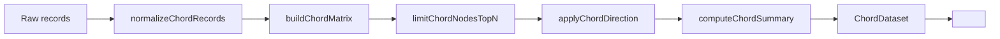

# ChordChart

Complements the existing Sankey visualization. Answers “who is trading load with whom?” for teams, repos, and work types.

## Purpose

The chord chart is a relationship-flow view for cross-entity exchange: it makes the strongest bilateral pairs, import/export imbalances, and overflow concentration legible at a glance. It is rendered with ECharts v6 native `series.type: 'chord'` and plugs into the existing `<Chart>` wrapper so it inherits the shared chart theme, tooltip behavior, resize handling, and readiness lifecycle already used across the chart library.

## API

### `ChordChart`

| Prop | Type | Required | Default | Notes |
| --- | --- | --- | --- | --- |
| `dataset` | `ChordDataset` | Yes | — | Fully processed dataset from `buildChordDataset(...)`. |
| `unit` | `string` | No | `"items"` | Used in tooltip/value formatting. |
| `height` | `number \| string` | No | `420` | Applied to the chart container. |
| `width` | `number \| string` | No | `"100%"` | Applied to the chart container. |
| `className` | `string` | No | — | Container class. |
| `style` | `CSSProperties` | No | — | Merged with `height` / `width`. |
| `tooltipFormatter` | `(params: unknown, unit: string) => string` | No | Internal formatter | Override for custom HTML tooltip content. |
| `onItemClick` | `(item: { type: "node" \| "link"; name?: string; source?: string; target?: string; value?: number }) => void` | No | — | Receives normalized node/link click payloads. |

### `ChordChartControls`

| Prop | Type | Required | Default | Notes |
| --- | --- | --- | --- | --- |
| `value` | `ChordControlsValue` | Yes | — | Controlled state for direction, grouping, top-N, self-links, and Other bucket. |
| `onChange` | `(next: ChordControlsValue) => void` | Yes | — | Emits the fully next control state. |
| `otherAvailable` | `boolean` | No | `true` | Disables the Other-bucket checkbox when aggregation is not needed. |
| `className` | `string` | No | `""` | Wrapper class for layout integration. |

Related exports for URL-synced control surfaces:

- `parseChordControlsFromSearchParams(...)`
- `serializeChordControlsToSearchParams(...)`
- `CHORD_CONTROLS_DEFAULTS`

### `ChordSummaryPanel`

| Prop | Type | Required | Default | Notes |
| --- | --- | --- | --- | --- |
| `dataset` | `ChordDataset \| null` | Yes | — | `null` enables loading / empty states without fabricating data. |
| `unit` | `string` | No | — | Included in row `aria-label`s and compact value display. |
| `loading` | `boolean` | No | — | Shows skeleton placeholders. |
| `className` | `string` | No | `""` | Wrapper class. |
| `onEntitySelect` | `(entityId: string) => void` | No | — | Fired when a summary row button is activated. |

## Data flow

Raw records flow through the pure transform pipeline in `src/lib/chord.ts`, then render as a chord plus companion summary:

`raw records -> buildChordDataset(records, opts) -> ChordDataset { nodes, matrix, totalFlow, summary } -> <ChordChart dataset={...} />`



## Minimal usage

```tsx
import { ChordChart } from "@/components/charts/ChordChart";
import { ChordSummaryPanel } from "@/components/charts/ChordSummaryPanel";
import { buildChordDataset } from "@/lib/chord";
import type { ChordRecord } from "@/lib/types";

const records: ChordRecord[] = [
  { source: "Growth", target: "Mobile", value: 24 },
  { source: "Mobile", target: "Growth", value: 20 },
  { source: "Platform", target: "Core", value: 12 },
  { source: "Core", target: "Platform", value: 4 },
];

const dataset = buildChordDataset(records, {
  grouping: "team",
  direction: "bilateral",
  topN: 8,
  unit: "reviews",
});

export function Example() {
  return (
    <div className="grid gap-6 lg:grid-cols-[1fr_360px]">
      <ChordChart dataset={dataset} unit="reviews" />
      <ChordSummaryPanel dataset={dataset} unit="reviews" />
    </div>
  );
}
```

## Advanced usage

- **Custom tooltip** via `tooltipFormatter` when the default node/link HTML needs domain-specific copy or links.
- **Drill-through clicks** via `onItemClick` on the chart and `onEntitySelect` on the summary panel.
- **Controlled controls** for embedded dashboards or stories.
- **URL-param-synced controls** for app routes that need shareable deep links.

Custom tooltip + click handling:

```tsx
<ChordChart
  dataset={dataset}
  unit="hours"
  tooltipFormatter={(params) => `<strong>Exchange</strong><br />${JSON.stringify(params)}`}
  onItemClick={(item) => {
    if (item.type === "node" && item.name) {
      console.log("drill into entity", item.name);
    }
  }}
/>
```

Controlled controls:

```tsx
const [controls, setControls] = useState(CHORD_CONTROLS_DEFAULTS);

<ChordChartControls value={controls} onChange={setControls} otherAvailable />
```

URL-param-synced controls:

```tsx
const searchParams = useSearchParams();
const [controls, setControls] = useState(() => parseChordControlsFromSearchParams(searchParams));

const updateControls = (next: ChordControlsValue) => {
  setControls(next);
  const params = serializeChordControlsToSearchParams(next, new URLSearchParams(searchParams.toString()));
  window.history.replaceState(window.history.state, "", `?${params.toString()}`);
};
```

## Extension points

- **Adding new grouping dimensions**: extend `ChordGroupingDimension` in `src/lib/types.ts`, then update the URL enum handling and control helpers in `ChordChartControls.tsx`.
- **Custom color schemes**: override the shared `chartTheme` CSS variables; do **not** pass a direct `color` array into the series.
- **New summary insight categories**: extend `ChordSummary` and `computeChordSummary(...)` in `src/lib/chord.ts`.

## Accessibility

- ECharts v6 `aria` is enabled by default.
- Each rendered chart exposes an accessible image description summarizing grouping, total flow, and entity count.
- `ChordChartControls` uses a segmented `radiogroup` with arrow-key navigation.
- `ChordSummaryPanel` rows are real buttons and remain keyboard-focusable.

## Known limitations / future work

### Directional modes collapse on current backend data (v1)

The same-dimension flow comes from a **two-hop projection** (`TEAM → REPO → TEAM`, `REPO → TEAM → REPO`, `WORK_TYPE → REPO → WORK_TYPE`) because the backend rejects `path: [X, X]`. The projection is mathematically a **co-occurrence metric**: for every repo R, every pair of teams touching R contributes `w_src × w_tgt` to both `m[src][tgt]` and `m[tgt][src]`. This makes the matrix **symmetric by construction**.

Consequence — direction modes in `ChordChartControls`:

| Mode | Formula | Behaviour on symmetric input |
| --- | --- | --- |
| **Bilateral** | `m[i][j] + m[j][i]` | Renders correctly (doubled values). |
| **Outflow** | `m[i][j]` | Renders the same matrix as Inflow (transpose of symmetric = itself). |
| **Inflow** | `m[j][i]` | Identical to Outflow. |
| **Net** | `max(0, m[i][j] − m[j][i])` | Always `0` → empty state. |

Summary panel — `topImporters` / `topExporters` filter on `incoming > outgoing` vs `outgoing > incoming`, which are always equal on symmetric input → both sections render "—" in every mode. Only **Strongest exchange** (bilateral pair ranking) is semantically meaningful with current data.

**Recommended v1 interpretation**: read the chord as a **collaboration-through-shared-repositories** view. The "Strongest exchange" list is the primary signal; direction modes and importer/exporter sections are placeholders for when directional data lands.

**Unlock path**: CHAOS-1289 introduces native `analytics.sankey path: [X, X]` queries on the backend, or an alternative directional edge source (author → reviewer via PRs, issue-blocking relationships, etc.). The UX follow-up is tracked under a sibling issue; once directional data is available, the `applyChordDirection` math will produce meaningful in/out/net matrices with no changes to the pure math library.

### Other

- Same-dimension backend flow is a **two-hop projection**. See **CHAOS-1289** for the backend follow-up that would enable direct same-dimension queries.
- No animated transitions between groupings yet (tracked as follow-up work beyond v1).
- Desktop-first layout uses `grid-cols-[1fr_360px]`; mobile falls back to a single-column stack.

## Related

- Parent milestone: CHAOS-1279
- Backend follow-up: CHAOS-1289
- ECharts v6 chord docs: https://echarts.apache.org/en/option.html#series-chord
